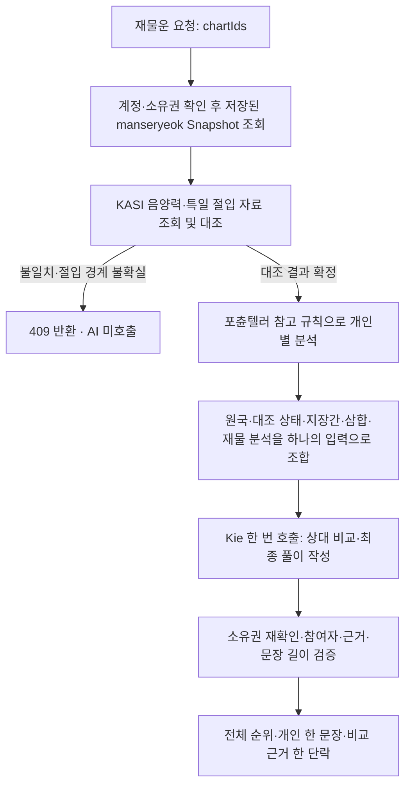

# 재물운: 세 자료를 분석한 뒤 Kie에 전달하는 흐름

2026-09-14. 현재 내부 정책은 `saju-reading-evidence-v3`, 포츈텔러 참고 분석은 `fortuneteller-reference-v1`, 최종 풀이 프롬프트는 `wealth-ranking-v5`다.

## 실제 실행 순서



`WealthRankingService.create`의 `provider.assertAvailable()`은 활성화 설정과 키 존재 여부를 확인하는 로컬 검사다. 네트워크 호출이 아니다. 실제 Kie 호출은 KASI의 모든 `verify`를 `await Promise.all`로 기다리고 `buildWealthRankingContext`가 모든 참여자의 분석을 반환한 다음 `provider.generate`에서 시작한다.

만세력은 프로필 저장 시 계산한 불변 결과를 재사용한다. 포츈텔러는 검토한 규칙을 서버 코드로 구현하여 로컬에서 실행한다. 두 작업은 네트워크 대기 시간이 없고 KASI도 월별 캐시가 적중하면 빠르게 끝난다. AI가 빨리 호출된다는 사실만으로 전처리가 생략됐다고 판단할 수 없다.

## 세 자료의 역할과 AI에 실제 전달되는 값

| 출처 | 서버에서 하는 일 | AI 입력 |
| --- | --- | --- |
| `manseryeok@2.0.0` | 저장된 사주 원국·일간·십성·오행을 조회 | `facts`, `dayMaster`, `elementDistribution`, `calculationPolicy` |
| KASI 음양력 API | 해당 날짜의 양력·음력·윤달이 저장값과 맞는지 대조 | `calendarVerification` |
| KASI 특일 API | 절입 시각으로 기존 연주·월주와 경계 불확실성을 대조 | `solarTermVerification` |
| `fortuneteller` 참고 규칙 | 지장간·삼합, 월령 관계, 대표 십성 분포, 강약 추정, 용신 후보, 월지 지장간 투출, 재물 조합 분석 | `hiddenStemFacts`, `branchRelations`, `fortuneTellerAnalysis` |
| 자체 재물 성향 분류 | 정재·편재·식상·비겁·관성·인성 근거와 재성의 지장간 존재를 묶음 | `wealthAnalysis` |

KASI 원문 XML이나 생년월일을 모델에 재전송하지 않는다. 원문은 서버의 대조에 사용하며 검증 범위와 성공/미완료 상태를 모델에 전달한다. KASI는 용신이나 재물운을 제공·인증하는 서비스가 아니다. 서로 다른 달력 엔진에서 나온 원국을 평균하거나 섞지 않는다.

KASI 비활성·조회 실패·자료 없음·이전 계산 정책은 각각 `disabled`, `unavailable`, `no_data`, `unsupported_policy`로 명시한다. 이 경우 기존 정책대로 저장된 원국 기반 풀이를 허용하고 응답 `notice`에 미완료를 표시한다. 세 출처가 모두 성공했다고 꾸미지 않는다. 실제 불일치나 절입 경계 불확실은 AI 호출 전에 중단한다.

## 포츈텔러에서 검토한 내용

고정 리비전: [`1a930ad54c5342b855222e3aa304809b0ed587d5`](https://github.com/hjsh200219/fortuneteller/tree/1a930ad54c5342b855222e3aa304809b0ed587d5).

| 참고 소스 | 채택한 규칙 | 이 서버의 적용 기준 |
| --- | --- | --- |
| [earthly_branches.ts](https://github.com/hjsh200219/fortuneteller/blob/1a930ad54c5342b855222e3aa304809b0ed587d5/src/data/earthly_branches.ts) | 지장간·완전 삼합·월지와 일간의 생극 관계 | 기존 Snapshot 위에서 파생, 월령 관계와 관찰 근거 ID를 기록 |
| [ten_gods.ts](https://github.com/hjsh200219/fortuneteller/blob/1a930ad54c5342b855222e3aa304809b0ed587d5/src/lib/ten_gods.ts) | 십성 분포를 먼저 계산하는 구조 | 천간 3개와 지지 본기 4개를 각각 한 번 집계, 일간 위치만 제외 |
| [day_master_strength.ts](https://github.com/hjsh200219/fortuneteller/blob/1a930ad54c5342b855222e3aa304809b0ed587d5/src/lib/day_master_strength.ts) | 월령·비겁·인성·재관식상에 따른 강약 추정식 | 아래에 공개한 방법으로 계산, 재물 점수로 사용 금지 |
| [yong_sin.ts](https://github.com/hjsh200219/fortuneteller/blob/1a930ad54c5342b855222e3aa304809b0ed587d5/src/lib/yong_sin.ts) | 강한 일간은 식상·재성, 약한 일간은 인성·비겁을 균형 후보로 읽음 | 확정 용신이 아닌 후보만 제공, 중화이면 추가 방법 필요로 표시 |
| [gyeok_guk.ts](https://github.com/hjsh200219/fortuneteller/blob/1a930ad54c5342b855222e3aa304809b0ed587d5/src/lib/gyeok_guk.ts) | 월지·십성으로 구조를 읽는 관점 | 월지 본기와 지장간의 천간 투출만 관찰, 격국은 확정하지 않음 |
| [fortune.ts](https://github.com/hjsh200219/fortuneteller/blob/1a930ad54c5342b855222e3aa304809b0ed587d5/src/lib/fortune.ts) | 정재·편재의 역할, 식상과 재성, 비겁과 재성을 함께 읽는 관점 | 근거 묶음·재물 성향·실천 방향을 준비, 원본 운세 문장이나 점수는 복사하지 않음 |

원본과의 차이는 의도적이다. 원본의 십성 집계는 일간과 같은 천간을 다른 기둥에서도 제외하므로 비견이 누락될 수 있다. 이 구현은 일간이라는 **위치**만 제외한다. 또한 원본의 절기별 지장간 가중치를 도입하지 않았으므로 분포와 강약 값이 원본 MCP의 결과와 같다고 주장하지 않는다. 지장간 본기를 지지 본기와 중복 가산하지 않는다.

격국 함수는 주석과 달리 십성 최다 개수로 일반 격을 정하는 부분이 있어 그대로 채택하지 않았다. 여기서는 월지 본기, 월지 지장간이 년간·월간·시간에 나타나는지를 계산한 관찰값을 제공한다. 일간 자체는 투출 관찰에서 제외한다. 확정 격국·종격을 주장하지 않는다.

## 공개한 강약 추정 방법

`heuristicScore = clamp(50 + 월령 + 비겁 + 인성 + 재관식상, 0, 100)`

| 항목 | 가산·감산 |
| --- | --- |
| 월지 본기가 일간과 같은 오행 | +40 |
| 월지 본기가 일간을 극함 | -20 |
| 그 외 월지 관계 | +20; 원본의 간이 규칙이며 별도 `isSupporting`과 구분 |
| 비겁 관찰 개수 0 / 1 / 2~3 / 4 이상 | -10 / +5 / +15 / +25 |
| 인성 관찰 개수 0 / 1 / 2 / 3 이상 | 0 / +5 / +15 / +20 |
| 재관식상 관찰 개수 0~3 / 4~5 / 6 이상 | 0 / -5 / -15 |

80 이상 `very_strong`, 65 이상 `strong`, 40 이상 `medium`, 25 이상 `weak`, 그 미만 `very_weak`이다. 이 값은 명시적 해석 정책의 참고 추정이며 부·성공 확률·객관적 강도를 측정하지 않는다. 원국의 오행 개수 표시와도 별개다. AI에는 이 점수를 재물 순위로 정렬하지 않도록 지시한다.

시간 미상은 5개의 대표 십성 관찰만 제공하고 `dayMasterStrength`, `yongSinCandidates`를 null로 둔다. `status=complete`는 채택한 분석 항목에 필요한 시주가 있다는 뜻이며 모든 명리 분석이나 공식 대조가 완료됐다는 뜻이 아니다.

## 재물 분석과 최종 풀이의 경계

서버가 계산해 제공하는 재물 조합은 정재, 편재, 식상·재성의 공존, 비겁·재성의 공존, 인성·식상의 공존이다. 각 조합에는 실제 근거 ID의 묶음과 실천 방향이 있다. 재성이 없다는 이유만으로 빈곤을 단정하거나, 공존만으로 식상생재의 완전한 성립을 단정하지 않는다.

AI는 원국·강약·용신 후보를 새로 계산하지 않고 이 분석 결과를 읽어 **참여자 간 상대 비교, 개인 한 문장, 비교 근거**를 작성한다. 순위 자체는 아직 AI의 최종 상대 해석이다. 서버가 수치로 순위를 고정하는 별도 재물 점수 정책은 도입하지 않았다. 반복 생성의 순서·문구가 항상 같다는 보장도 없다.

신살, 조후·통관·병약의 종합 용신, 대운·세운·월운, 절기별 지장간 세력은 이번 기간 없는 재물 성향 비교에 포함하지 않는다. 확정되지 않은 판단은 프롬프트에서 생성하지 않도록 제한한다.

## 요청 순서를 확인하는 로그

아래는 실제 데이터가 아닌 이벤트 순서 예시다. 같은 `requestId`로 확인한다. 준비 단계는 운영 기본값 `LOG_LEVEL=info`에서도 기록한다.

```text
wealth_ranking_started
wealth_ranking_charts_loaded       source=manseryeok mode=saved_snapshot
wealth_ranking_references_started
wealth_ranking_references_checked  calendarStatuses=[...] solarTermStatuses=[...]
wealth_ranking_analysis_started    source=fortuneteller mode=local_reference_rules
wealth_ranking_analysis_completed  policyVersion=fortuneteller-reference-v1 completeCount=... partialCount=...
wealth_ranking_ai_started          preparationDurationMs=...
kie_request_started               [debug: 여기서 실제 외부 AI 호출]
wealth_ranking_ai_received
wealth_ranking_completed
```

원문 요청·이름·생년월일·키·AI 문장은 로그에 넣지 않는다. 전처리 실패도 `wealth_ranking_failed`에 `load_owned_charts`, `kasi_verification`, `server_analysis` 등 단계와 상태를 남긴다. 외부 호출 로그는 기존 `requestId`, `callId`, endpoint 및 오류 단계로 추적한다.

## 설정과 호환성

추가 API 키나 MCP 서버 설치는 필요 없다. KASI 키는 `.env`의 `KASI_SERVICE_KEY`, `KASI_SPECIAL_SERVICE_KEY`, AI 키는 `KIE_API_KEY`를 사용한다. KASI 활성화 변수와 timeout은 기존 값을 유지한다. 모델은 `src/config/ai-model.config.ts`에서 변경한다.

공개 요청·응답 JSON 구조와 DB Snapshot은 유지하며 `promptVersion`만 v5로 올라간다. OpenAPI 설명을 보완한다. Frontend 변경이나 DB migration은 없다. 외부 저장소 코드를 서버 시작 시 다운로드하거나 실행하지 않는다.

검증은 참조 유효성·시간 미상·동일 천간 비견 집계·강약 분기·용신 후보·월지 투출 및 KASI 요청이 모두 끝나기 전 Kie 미호출을 포함한다. Provider transport test에서도 실제 HTTP 요청 body에 분석 결과가 포함되는지 검사한다.

## 이번 검증 결과

- `npm run lint`, TypeScript 검사, `npm run build` 통과.
- 단위 테스트 215개, E2E 85개 통과.
- `npm run check:wealth-ranking -- --with-ai`를 합성 인물 2명으로 1회 실행했다. 실제 사용자 프로필·DB를 조회하지 않았다.
- 2026-09-14 14:48 KST: KASI 음양력 HTTP 200(약 92ms), 특일 HTTP 200(약 80ms). 두 인물 모두 음양력·연주/월주 대조 `matched`.
- 포츈텔러 참고 분석 2명 완료 후 Kie 호출 시작. Kie HTTP 200(약 3.8초), `wealth-ranking-v5` 순위 2명·개인 문장·비교 근거가 서버 검증을 통과했다.
- 이 실호출 1회는 연결과 응답 구조의 검증이다. 명리 해석 품질 전체나 반복 생성의 일관성을 입증하는 평가는 아니다.
