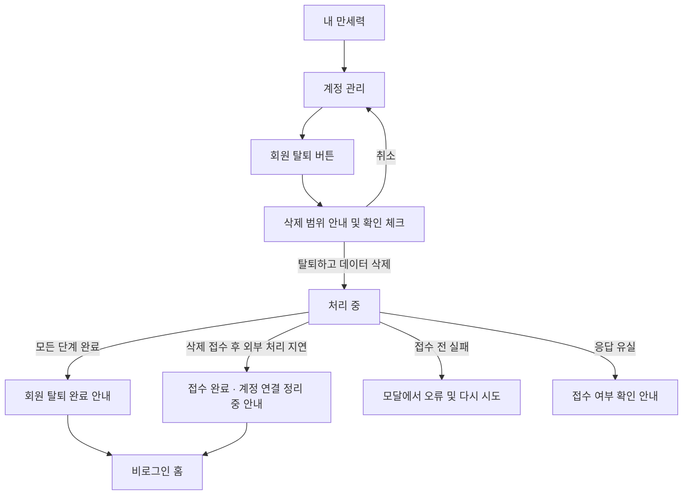

# 선녀 사주 회원 탈퇴 기획안

작성일: 2026-09-10. 상태: 화면·API·DB 처리 구현 및 자동 검증 완료. 실제 Provider 연동과 전용 계정 탈퇴·재가입 검증은 서버 키 설정 후 진행한다. 아래는 승인된 기획이며, 구현 결과와 운영 설정은 [회원 탈퇴 구현 문서](./account-withdrawal.md)를 따른다.

회원 탈퇴 진입 화면, 최종 확인, 앱 데이터 영구 삭제, 카카오 연결 해제, Supabase Auth 계정 삭제, 브라우저 정리까지 하나의 기능으로 다룬다. 대표 프로필 수동 변경은 다음 작업이다. 실제 사용자 계정의 탈퇴는 실행하지 않았다.

## 1. 기본 정책 제안

- 본인 인증 세션으로 본인의 계정만 탈퇴할 수 있다.
- 확인 후 삭제를 시작하며 복구 유예 기간이나 탈퇴 취소 기능은 두지 않는다.
- 해당 계정이 등록한 본인·가족·지인 프로필을 모두 삭제한다. 다른 사용자의 계정이나 프로필에는 영향이 없다.
- 최종 완료 시 앱 사용자와 종속 데이터, Supabase Auth 계정, 카카오의 선녀 사주 연결이 제거되어야 한다.
- 같은 카카오 계정으로 다시 가입할 수 있지만 새 회원으로 시작한다. 과거 프로필·동의·계산 이력은 복원하지 않는다.
- 탈퇴 사유 설문과 문구 직접 입력은 첫 버전에 넣지 않는다. 삭제 안내 확인 체크박스와 최종 버튼으로 의사를 확인한다.
- 가입 미완료·이용 정지 상태도 유효한 본인 인증이 있으면 탈퇴할 수 있게 한다. 프로필 API의 활성 회원 제한을 탈퇴 API에 그대로 적용하지 않는다.
- 현재 실제 저장되지 않는 AI 풀이·결제·업로드 데이터는 존재하는 것처럼 안내하지 않는다. 이 기능들이 추가될 때 삭제 대상과 안내를 함께 확장한다.

## 2. 현재 코드에서 확인한 출발점

| 영역 | 현재 상태 | 필요한 변경 |
| --- | --- | --- |
| 내 만세력 `/my-saju` | 계정 관리 메뉴가 있으나 연결 경로 없음 | `/account`로 연결 |
| 계정 관리 | 실제 화면 없음 | 로그인 정보, 로그아웃, 회원 탈퇴 화면 추가 |
| 삭제 확인 UI | 사주 프로필 삭제 모달 존재 | 디자인 패턴을 참고하되 계정 전체 삭제 안내와 접근성 구현 |
| 회원 API | 내 정보 GET, 가입 확인 PUT | 본인 탈퇴 DELETE 추가 |
| 앱 사용자 | `withdrawn`, `withdrawnAt` 필드만 존재 | 탈퇴 처리 중 접근 차단에 사용하고 최종 행 삭제 |
| DB 관계 | 사용자 → 동의·프로필·등록 요청, 프로필 → 차트 cascade | 전체 삭제와 대표/현재 차트 참조 정리 검증 |
| 인증 | Supabase `/auth/v1/user`로 토큰 확인, 실제 로그인 버튼은 카카오 | 서버 전용 Auth 삭제·카카오 연결 해제 연동 |
| 브라우저 | Supabase 세션, Query 캐시, 데모 구매 sessionStorage | 탈퇴 후 요청 취소·캐시·세션 정리 |

Frontend 초기 문서에는 실제 인증 미구현 등의 오래된 설명이 있다. 이번 기획은 실제 호출부와 서버 계약을 기준으로 한다.

## 3. 화면 흐름과 문구



### 계정 관리 `/account`

- 헤더: 뒤로가기, `계정 관리`.
- 본문: 현재 표시 이름과 `카카오로 로그인 중` 안내, 로그아웃 버튼.
- 하단: 본문과 간격을 두고 `회원 탈퇴` 텍스트 버튼. 로그아웃과 별개의 행동으로 배치한다.
- 기존 모바일 App Shell 폭, 색상, 버튼, safe area 규칙을 따른다.
- 아직 없는 알림 설정·고객센터 메뉴를 이 작업에서 만들지 않는다.
- 탈퇴 완료 상태로 넘어갈 때 기존 AuthGate가 로그인 화면으로 먼저 이동하지 않도록 완료 안내는 비로그인 상태에서도 표시 가능하게 구성한다.

### 최종 확인 모달

제목: **정말 탈퇴하시겠어요?**

본문:

> 탈퇴하면 회원정보와 등록한 모든 사주 프로필, 출생정보, 만세력 계산 이력이 영구 삭제돼요.
> 삭제된 데이터는 복구할 수 없으며, 다시 가입해도 이전 기록은 돌아오지 않아요.

보조 안내:

> 카카오의 선녀 사주 연결도 해제돼요. 카카오 계정 자체는 삭제되지 않아요.

체크박스: `모든 데이터가 삭제되고 복구할 수 없음을 확인했어요.`

버튼: `취소` / `탈퇴하고 데이터 삭제`.

- 체크 전에는 최종 버튼을 비활성화한다. 모달을 다시 열면 체크와 이전 오류를 초기화한다.
- 최종 버튼만 destructive 색상을 사용한다. 최초 포커스는 취소 버튼에 둔다.
- 포커스 가두기·복귀, 배경 접근 차단, 스크롤 잠금, 제목/설명 연결을 지원한다.
- 요청 전 Escape로 닫을 수 있다. 처리 중 중복 제출과 모달 닫기는 막는다. 브라우저 종료까지 막지는 않으며 서버가 작업을 이어간다.
- 처리 중 문구는 `탈퇴 처리 중…`. 실패 시 오류를 모달 안에서 표시한다.

### 처리 결과

| 상태 | 안내와 동작 |
| --- | --- |
| 실제 완료 | `회원 탈퇴가 완료됐어요. 계정과 등록한 사주 데이터가 삭제됐어요.` → 홈으로 이동 |
| 삭제 접수·외부 정리 지연 | `탈퇴 요청이 접수됐어요. 등록한 사주 데이터는 삭제됐고, 계정 연결을 정리하고 있어요.` → 로컬 로그아웃 후 홈 이동 가능 |
| 접수 전 실패 | `탈퇴 요청을 접수하지 못했어요. 잠시 후 다시 시도해주세요.` 기존 계정과 데이터 유지 |
| 타임아웃·연결 끊김 | `처리 결과를 확인하지 못했어요. 탈퇴 요청이 접수됐을 수 있어요.` 성공이나 미삭제로 단정하지 않음 |
| 인증 만료 | 재로그인 안내. 만료 자체를 탈퇴 성공으로 해석하지 않음 |

접수 이후에는 삭제 취소로 돌아가지 않는다. `202`와 타임아웃을 `탈퇴 완료`로 표시하지 않는다.

## 4. 삭제 대상

| 대상 | 처리 |
| --- | --- |
| `users` | 표시 이름·대표 참조 등을 정리하고 최종 단계에서 행 hard delete |
| `user_consents` | 약관·개인정보·연령 확인 기록 전체 삭제 |
| `saju_profiles` | 계정 소유의 모든 프로필과 출생정보 삭제 |
| `saju_charts` | 현재 차트뿐 아니라 모든 과거 Snapshot 삭제 |
| `saju_profile_creations` | 재시도 키·해시와 이미 삭제된 프로필의 요청 기록까지 삭제 |
| Supabase Auth | Admin API로 계정 hard delete, identity/session/refresh token 정리 결과 검증 |
| 카카오 | 해당 카카오 앱과 사용자 연결 해제 |
| 브라우저 | Supabase 세션·인증 snapshot, 사용자·프로필·미리보기 캐시, 데모 구매 저장값 정리 |
| 탈퇴 처리 기록 | 실패 복구에 필요한 최소 식별자·처리 단계만 임시 보유, 최종 성공 시 삭제 |

현재 `users.auth_subject`는 Supabase `auth.users`를 참조하는 FK가 아니다. Auth 계정 삭제만으로 앱 데이터가 cascade 삭제된다고 가정하면 안 된다.

삭제 보장은 서비스가 관리하는 계정·저장 데이터에 대한 것이다. 기존 백업·인프라 로그·사용자가 내려받은 사본을 API 한 번으로 동시에 지운다고 약속하지 않는다. 출시 전 실제 백업 보존/복구 정책을 확인하고 안내와 맞춘다. 백업 복원 시 이미 탈퇴한 계정이 서비스에 다시 노출되지 않도록 삭제 반영 절차도 필요하다.

## 5. 서버 처리와 실패 복구

DB, 카카오, Supabase Auth는 하나의 Prisma transaction으로 묶을 수 없다. DB에 재개 가능한 탈퇴 작업을 먼저 기록하고, 접수 후 서비스 접근을 차단한 상태에서 외부 정리를 완료하는 방식을 제안한다.

1. Bearer 토큰과 삭제 확인 입력을 검증한다. 사용자 ID·카카오 ID는 클라이언트에서 받지 않는다.
2. 같은 인증 주체의 작업을 잠근다. 탈퇴 작업을 유일하게 생성하거나 기존 작업을 재사용한다.
3. 한 DB transaction에서 앱 사용자를 `withdrawn`으로 전환하고 표시 이름과 대표 참조를 비운다. 동의, 모든 프로필·차트, 모든 등록 요청 기록을 삭제하고 작업을 커밋한다. 앱 사용자가 없는 가입 미완료 계정도 작업을 만들 수 있다.
4. 서버가 신뢰할 수 있는 Supabase Auth identity에서 카카오 회원번호를 확인하고 필요한 최소값을 작업에 보관한다. 브라우저의 수정 가능한 metadata를 삭제 대상의 근거로 삼지 않는다.
5. 카카오 연결 해제를 수행하고 결과 단계를 기록한다.
6. Supabase Auth 계정을 hard delete한다. 이미 삭제된 상태는 확인 후 완료된 단계로 취급한다.
7. 마지막 DB transaction에서 임시 사용자 행과 탈퇴 작업의 식별 데이터를 삭제한다. 최종 상태를 확인한 요청만 완료 응답을 반환한다.

외부 API 호출은 DB transaction을 열어둔 채 수행하지 않는다. 정상 상황에는 요청 시간 안에 완료를 시도하고, 시간이 더 필요한 경우에는 영속 작업을 남겨 재시도한다.

### 재시도와 동시성

- 탈퇴 작업은 사용자 소유 데이터와 별도로 유지해 앱 데이터 삭제로 같이 사라지지 않게 한다.
- 저장 필드는 인증 주체, 필요한 Provider 식별자, 처리 단계, 시도 횟수, 다음 시도 시각, 작업 임대 정보 정도로 제한한다. 이름·출생정보·Snapshot·사용자 토큰·Provider 원문을 복제하지 않는다.
- 프로세스 재시작 뒤에도 재개하고, 다중 인스턴스는 한 작업을 동시에 실행하지 않도록 DB에서 작업을 선점한다. 새 범용 큐 프레임워크를 먼저 도입하지 않는다.
- 일시 장애는 간격을 늘려 재시도한다. 인증 설정 오류나 장기 실패는 운영자가 알 수 있게 하고, 성공 처리하거나 작업을 조용히 폐기하지 않는다.
- 외부 성공 직후 프로세스가 죽어도 재개할 수 있게 단계별 이미 완료 상태를 확인한다. 카카오의 미연결 응답과 단순 인증·권한 오류는 구별한다.
- 탈퇴 시작 이후 프로필 생성·수정, 가입 확인, 기존 토큰을 통한 재활성화를 차단한다. 새 가입 동작과 탈퇴 최종 삭제에도 동일한 인증 주체 기준 잠금 순서를 적용한다.
- 특히 현재 가입 확인 API의 `upsert`는 탈퇴 전에 인증된 지연 요청으로 회원을 다시 만들 수 있다. 회원 생성 직전 잠금 안에서 현재 Auth 계정 존재·요청 인증 유효성 및 탈퇴 작업 여부를 다시 확인하는 경계를 설계하고 경합 테스트로 고정한다.
- 카카오 연결 해제와 Auth 삭제 사이 재로그인, Auth 삭제 직후 같은 카카오의 새 Auth identity 생성도 검증한다. Provider 회원번호가 같다는 이유만으로 완료된 옛 작업이 새 계정을 삭제하거나 다시 연결 해제해서는 안 된다. 재시도마다 대상 Auth identity와 처리 세대를 확인한다.
- 원격 서비스에서 이미 실행된 요청과 재가입이 겹치는 경계는 연결 결과 조회 및 재시도 의미를 실제 Provider 계약으로 확인한다. 이 경계 검증이 끝나기 전 완전한 탈퇴·재가입 흐름의 출시 완료로 판단하지 않는다.

## 6. API 초안

`DELETE /v1/users/me`

```json
{ "confirmDataDeletion": true }
```

인증된 본인만 대상으로 한다. Zod strict schema로 `true` 확인값만 허용하고, 서버가 인증 주체에서 삭제 대상을 결정한다. 성공과 실패 모두 `Cache-Control: no-store`를 적용한다.

| HTTP | data / reason | 의미 |
| --- | --- | --- |
| `200` | `{ "status": "completed" }` | 앱·Auth·카카오 정리까지 확인 완료 |
| `202` | `{ "status": "processing" }` | 서비스 데이터 삭제 및 영속 작업 접수, 외부 정리 계속 진행 |
| `400` | `VALIDATION_ERROR` | 확인값 누락 또는 잘못된 입력 |
| `401` | `AUTHENTICATION_REQUIRED` | 유효한 본인 인증 없음 |
| `429` | `RATE_LIMITED` | 반복 요청 제한, Retry-After 제공 |
| `503` | `ACCOUNT_WITHDRAWAL_UNAVAILABLE` | 접수 전에 필요한 처리를 수행하지 못함 |

기존 `{ code, message, data }` envelope를 유지하고 HTTP status와 `code`를 일치시킨다. 일반 미처리 오류는 기존 공통 500 계약을 따른다. DB 커밋 이후 외부 정리 지연을 신규 요청 접수 실패로 반환하지 않는다.

- 인증 주체별 작업 유일성으로 중복 DELETE를 처리한다. 완료 후 기존 토큰이 거부되는 경우까지 200으로 만들기 위해 인증을 완화하지 않는다.
- `GET /v1/users/me`는 탈퇴 처리 중 안전한 도메인 오류를 반환하도록 하고, Frontend는 가입 동의 모달을 다시 띄우지 않도록 함께 변경한다.
- 응답 유실 뒤 토큰이 유효하면 같은 DELETE 재시도로 기존 작업을 확인한다. 401 또는 다시 연결할 수 없는 상태는 완료를 증명하지 않으므로 접수 여부 불명 안내를 유지한다.
- 비로그인 공개 상태 조회 API는 첫 버전에 추가하지 않는다. 작업이 지연되어도 서버가 사용자 세션 없이 마무리할 수 있어야 한다.
- 이 제안은 endpoint 추가와 탈퇴 중 사용자 상태 처리의 확장이다. Backend Zod/OpenAPI/e2e와 Frontend DTO·오류 처리를 같은 구현 단위로 변경한다.

## 7. 외부 인증과 설정

현재 서버 설정에는 Supabase publishable key만 있다. 구현에는 서버 전용 Supabase Auth 관리 권한과 카카오 앱 어드민 키가 필요하다. 실제 key 확인·발급·변경은 이번 기획에서 실행하지 않는다.

- Supabase Admin 삭제는 서버에서만 수행하고 soft delete를 사용하지 않는다. [공식 삭제 API](https://supabase.com/docs/reference/javascript/auth-admin-deleteuser)
- 발급된 JWT가 삭제와 동시에 소멸한다고 가정하지 않는다. 현재 서버의 온라인 사용자 확인과 앱 상태 검사로 기존 토큰 접근을 차단하고, 클라이언트 인증 정보도 별도로 정리한다. [Supabase 사용자 삭제 설명](https://supabase.com/docs/guides/auth/managing-user-data#deleting-users)
- 카카오 로그인으로 가입한 사용자는 서비스 탈퇴 과정에 카카오 연결 해제를 포함해야 한다. Supabase identity 삭제가 카카오 unlink까지 수행하는 것으로 간주하지 않는다. [카카오 탈퇴 절차](https://developers.kakao.com/docs/ko/kakaologin/common#unlink)
- 카카오 서버 호출은 어드민 키와 서버에서 검증한 회원번호를 사용하는 방식을 우선 검토한다. [연결 해제 REST API](https://developers.kakao.com/docs/ko/kakaologin/rest-api#unlink)
- 구현 첫 단계에서 identity 회원번호 필드, 큰 정수의 손실 없는 취급, 미연결 상태 조회·응답, 중복 unlink 및 재로그인 동작을 계약으로 확인한다. 사용자 전체 metadata를 장기 저장하지 않는다.
- 키는 Backend 환경변수와 typed configuration으로만 관리한다. 브라우저, Next public 환경변수, API 응답, 로그에 포함하지 않는다.
- 현재 Storage 업로드 기능은 없지만 실제 환경에 사용자 소유 객체가 있는지 검증한다. 향후 업로드 도입 시 객체 삭제를 Auth 삭제 전에 포함한다.
- 카카오 측 연결 해제 callback 설정이 있다면 서비스발 unlink와 중복 처리 영향도 확인한다. 카카오 설정 화면에서 시작하는 별도 탈퇴 수신 기능은 현재 서비스 내 탈퇴 흐름과 요구사항을 구분한다.

## 8. Frontend 상태 정리

- 접수 전 오류에는 로그인과 데이터를 유지한다.
- 완료 또는 접수 확인 뒤에는 사용자 관련 진행 중 query를 취소하고 캐시를 제거한다. 늦게 도착한 응답으로 삭제한 사주가 다시 표시되지 않아야 한다.
- Supabase 로컬 세션, 쿠키, `authUserSnapshot`을 정리한다. Auth 계정이 이미 없어 원격 signOut이 오류를 반환해도 로컬 정리를 건너뛰지 않는다.
- 기존 로그아웃 함수는 오류가 나면 캐시를 유지하므로 그대로 호출하는 것만으로 완료 처리하지 않는다.
- 다른 열린 탭은 인증 변경 이벤트와 포커스 복귀 검증으로 개인 데이터를 비운다. 오프라인 기기의 화면을 원격으로 즉시 지운다고 보장하지 않으며 다음 연결 시 접근을 차단한다.
- `reading-purchase:demo:*` 등 서비스 소유 저장값만 지운다. `localStorage.clear()` 같은 전체 origin 삭제를 사용하지 않는다.
- 홈 이동은 replace를 사용하고, 뒤로가기·새로고침·재로그인 후 이전 개인 데이터가 나타나지 않는지 확인한다.

## 9. 구현 단위와 완료 기준

| 순서 | 작업 | 완료 기준 |
| --- | --- | --- |
| 1 | Provider 삭제·연결 해제 계약 확인 | 서버 권한, 신뢰 가능한 identity, 이미 삭제/미연결·재로그인 결과 확인 |
| 2 | DB 작업 기록과 탈퇴 use case | cascade, 일괄 삭제, 차단, 재시작 복구, 동시 실행 방지 |
| 3 | API·가입 경로 보완 | 본인 인증, Zod/OpenAPI, 중복 요청, 지연 가입 요청의 재생성 차단 |
| 4 | 계정 화면·모달·클라이언트 정리 | 취소/확인/오류/처리 중/완료 구분, 모바일·키보드 접근성 |
| 5 | 통합 검증 | 전용 테스트 사용자로 DB·인증·카카오 정리와 새 가입 확인 |

주요 변경 예상 범위:

- Backend: `modules/users` 탈퇴 계약·use case·재시도 처리, `modules/auth` Provider 관리 연동, 가입 확인·프로필 쓰기 경계, 환경변수, Prisma migration, OpenAPI, 테스트.
- Frontend: `/account` route, `domains/account`, `features/account_withdrawal`, user API/DTO, auth 및 캐시 정리, `/my-saju` 계정 관리 링크.
- 삭제 처리용 테이블은 서버 역할만 접근하도록 RLS·권한을 설정한다. 기존 migration을 수정하지 않고 새 migration을 기록한다.

검증해야 할 사례:

- 프로필 0개/여러 개, 현재·과거 차트, 이미 삭제된 프로필의 생성 요청 기록을 모두 제거한다.
- 다른 회원의 사용자·프로필·차트는 변경되지 않는다.
- 동의하지 않은 요청, 만료 토큰, 타인 ID 삽입, 반복 클릭은 허용된 계약으로 처리한다.
- 초기 transaction 실패 시 일부 삭제가 없고, 외부 호출 실패·타임아웃·서버 종료 후에도 작업이 복구된다.
- 카카오 성공 직후 종료, Auth 삭제 성공 직후 종료, 최종 DB 삭제 실패, 다중 worker를 각각 검증한다.
- 탈퇴와 프로필 쓰기·가입 확인이 겹쳐도 데이터나 계정이 부활하지 않는다.
- 기존 access/refresh token과 다른 탭에서 개인 리소스 접근이 차단된다.
- 같은 카카오로 새 가입하면 새 계정·새 동의로 시작하고 기존 기록이 나타나지 않는다.
- 비밀키·토큰·출생정보가 로그나 브라우저에 노출되지 않는다.
- Backend lint/unit/e2e/build 및 PostgreSQL integration, Frontend lint/build, 실제 브라우저 흐름을 확인한다. 실제 Provider 삭제 검증은 전용 테스트 계정으로 수행한다.

기능 공개 전 서버 전용 키와 migration, 재시도 실행·장기 실패 감지, 백업 복원 시 삭제 반영 절차가 준비되어야 한다. 준비되지 않은 외부 삭제를 mock 성공으로 대체해 탈퇴 완료를 표시하지 않는다.
