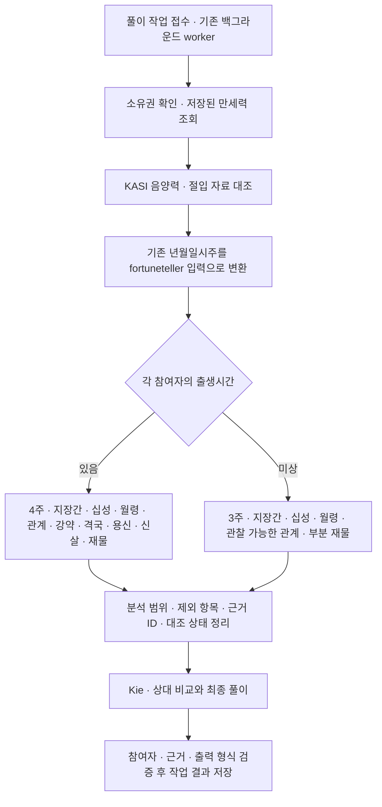

# 저장된 만세력 · KASI · fortuneteller 재물 분석

2026-09-14 현재 동작. 내부 근거 정책 `saju-reading-evidence-v4`, 분석 정책 `fortuneteller-native-v1`, AI 프롬프트 `wealth-ranking-v6`.

## 실제 요청 흐름



Kie의 최초 외부 요청은 KASI 대조와 모든 개인 분석이 끝난 뒤 발생한다. Provider 설정 점검은 외부 호출이 아니다. 기존 동기 endpoint도 동일한 분석 service를 사용하지만 결과 저장은 백그라운드 작업 경로에서 담당한다. [작업 API](./reading-jobs.md), [KASI 요청·실패 정책](./wealth-ranking-kasi.md).

## 설치한 라이브러리와 역할

`@hoshin/saju-mcp-server@1.2.0-sunnyeo.1`을 `file:vendor/fortuneteller` npm dependency로 설치했다. 원본은 [hjsh200219/fortuneteller의 고정 commit](https://github.com/hjsh200219/fortuneteller/tree/1a930ad54c5342b855222e3aa304809b0ed587d5)이다. 원본 npm 패키지 조회가 E404여서 원본 분석 소스와 필요한 데이터·타입을 로컬 포크로 관리한다. 기존 서버 재구현을 패키지 이름으로 감싼 방식이 아니라, 설치된 패키지에서 실제 원본 함수를 import하여 실행한다.

[출처·해시·패치·배포 안내](../vendor/fortuneteller/UPSTREAM.md), [실행 adapter](../src/modules/readings/infrastructure/fortuneteller-analysis.adapter.ts).

| 자료 | 현재 책임 | AI 입력 |
| --- | --- | --- |
| `manseryeok@2.0.0`과 서버 한국시 정책 | 기존 Snapshot의 원국·오행·십성·품질 | `facts`, `dayMaster`, `elementDistribution`, `calculationPolicy`, `warningCodes` |
| KASI 음양력 | 양력·음력 날짜·윤달 대조 | `calendarVerification` |
| KASI 특일의 절입 | 연주·월주 경계 대조 | `solarTermVerification` |
| 설치된 fortuneteller 분석 함수 | 원국에서 해석 재료 생성 | `hiddenStemFacts`, `branchRelations`, `fortuneTellerAnalysis` |
| Kie | 전달된 근거를 읽고 참여자 비교 및 한국어 풀이 | 순위·개인 한 문장·한 단락 근거 |

저장된 원국을 입력받으며 fortuneteller의 `calculateSaju`·시간 보정·음양력 변환은 호출하지 않는다. 기존 만세력 Snapshot과 시간 보정 정책을 변경하지 않는다. 원본의 별도 운세 점수는 상대 랭킹의 정렬 키로 쓰지 않는다.

## 개인별 전체·부분 분석

| 분석 | 시간 입력 | 시간 미상 |
| --- | --- | --- |
| 실제 사용 기둥 | 년·월·일·시 | 저장된 년·월·일, 시주 `null` |
| 지장간 세력·십성 분포 | 4주로 집계 | 3주로 집계, 시주 가중치 제외 |
| 월령·지지 관계 | 제공된 4주 | 제공된 3주에서 관찰 가능한 관계 |
| 일간 강약 `analyzeDayMasterStrength` | 호출 | 호출하지 않음, `null` |
| 격국 `determineGyeokGuk` | 호출 | 호출하지 않음, `null` |
| 용신 `selectYongSin` | 호출 | 호출하지 않음, `null` |
| 신살 `findSinSals` | 호출 | 호출하지 않음, `null` |
| 재물 `analyzeWealthFortune` | 원본 분석 | 부분 입력 패치로 원본 분석, 부재 표현을 3주 범위로 제한 |
| 재물 `referenceScore` | 참고용 원본 점수 | `null`, AI에 점수 전달 안 함 |

미상자의 `excludedAnalyses`는 `day_master_strength`, `gyeokguk`, `yongsin`, `sinsal`, `wealth_score`다. 해당 함수 일부가 3주만으로 실행 가능하더라도 전체 원국을 가정한 결론을 만들 수 있어 부분 분석에서는 제외한다. 임의 시간이나 가짜 시주로 타입을 만족시키지 않는다. 다른 상품의 건강·애정·취업 분석과 대운·세운 계산은 이번 재물운 연결 범위에 포함하지 않는다.

9명은 시간을 알고 1명은 모르면 9명은 전체 분석, 1명만 부분 분석을 받는다. 내부 분석의 혼합 인원 테스트로 이를 검증한다. 이 예시 때문에 공개 API의 기존 2~5명 제한을 변경하지는 않았다.

시간 미상의 0은 **관찰한 3주에서 해당 근거가 없다는 뜻**이다. 전체 원국에 재성이 없다고 확대하지 않고, 자료 부족 자체로 감점하거나 자료가 많다는 이유로 가점하지 않도록 프롬프트에 명시했다. 개인 문장에 부분 분석 범위를, 전체 근거에 순위의 불확실성을 표현하게 한다. 모델 문장과 별개로 서버 `notice`에도 시간 확인 후 해석·상대 순위가 달라질 수 있음을 추가한다.

기존 `day_boundary_uncertain` 경고를 보존한다. 한국시 보정으로 날짜 경계에서 일주가 달라질 수 있으므로 미상자의 일간 기반 분석은 저장 날짜를 기준으로 한 조건부 해석이다. 가능한 모든 시간대의 원국을 열거하는 방안은 이번에 구현하지 않았다. [이전 조사](./unknown-birth-time-integration-review-2026-09-14.md).

## 분석 순서와 원본 호환성 패치

1. 기존 원국의 한국어 천간·지지를 검증해 원본 `Pillar`로 변환한다. 양력·음력·윤달 메타데이터는 로컬 입력에만 보존한다.
2. 기존 월지로 寅=0 기준 월 번호를 만든다. `calculateJiJangGanStrength`를 먼저 호출한다.
3. `calculateTenGodsDistribution`은 년간·월간·시간과 지장간 세력을 집계한다. 일간 위치만 제외하고 다른 위치의 동일 천간은 비견으로 포함한다.
4. `checkWolRyeong`, `analyzeBranchRelations`와 시간 여부에 따른 원본 분석을 실행한다. 용신 선택에는 먼저 계산한 원본 강약 결과를 제공한다.
5. 필요한 출력 필드를 Zod로 검증·선택하고 익명 근거 ID와 연결한다. 원본 라이브러리 객체나 생년월일을 그대로 AI에 보내지 않는다.

원본의 동일 천간 누락, 월 번호 기준 차이, 소수 가중치 분기를 패치했다. 변경 diff는 vendor에 보존되어 있다. 강약·격국·용신·신살은 원본의 휴리스틱이며 전통 해석 전체의 확정값은 아니다. 지장간 가중치는 정규화된 확률이 아니다. 원본 전체 계산기와 호출 순서·오류 보정이 달라 분석 수치가 같다고 보장하지 않는다.

원본 재물 문구의 시기·투자 관련 단정은 프롬프트에서 그대로 옮기지 못하게 제한했다. `periodContext`는 계속 `null`이다. KASI는 달력·절입 대조 자료이며 미래 재산이나 운세의 정확성을 검증하지 않는다. 기존 만세력의 공망 등과 원본 간이 신살이 다르더라도 저장된 차트를 덮어쓰지 않는다.

## 보관한 자체 구현

[archive/readings-reference-v1](../archive/readings-reference-v1/README.md)에 기존 분석 3개와 테스트 3개를 모든 줄 주석 처리한 `.ts.disabled` 파일로 보관했다. 과거 설명 문서도 함께 보관했다. active import와 자동 fallback은 없으며 기존 `wealthAnalysis`는 더 이상 AI에 전달하지 않는다.

## 운영과 검증

인증키와 모델 설정은 기존 `.env` 및 `src/config/ai-model.config.ts`를 사용한다. fortuneteller는 서버 안에서 실행하므로 새 API 키가 필요 없다. 설치·컴파일 후 API와 worker 프로세스를 재시작한다. `npm run build`는 vendor 빌드도 실행한다. 운영 이미지에는 local dependency 링크 대상인 vendor 디렉터리도 포함한다.

주요 로그 순서:

```text
wealth_ranking_charts_loaded
wealth_ranking_references_started
wealth_ranking_references_checked
wealth_ranking_analysis_started    source=fortuneteller mode=installed_upstream_fork
wealth_ranking_analysis_completed  policyVersion=fortuneteller-native-v1 completeCount=... partialCount=...
wealth_ranking_ai_started
kie_wealth_ranking_started
```

원본 분석 실패는 기존 `wealth_ranking_failed`의 `stage=server_analysis`로 추적한다. 로그에는 생년월일·이름·API 키·원본 풀이를 남기지 않는다.

회귀 테스트는 설치된 함수 호출 여부, 미상자 제외 함수 미호출, 9+1 혼합 범위, Snapshot 불변, 12개월 가중치, 동일 천간과 소수 분포, 시주 근거 누출 방지, KASI 완료 후 AI 호출, 실제 AI 요청 body의 분석 포함을 확인한다. 외부 Provider는 fixture로 대체하며 새 실제 사용자·Kie 유료 요청은 실행하지 않는다. JSON 검증과 함수 동작 테스트는 풀이 예측의 정확성 보증이 아니다.

공개 요청·응답 JSON 구조, 인증 방식, DB schema와 기존 백그라운드 작업 API는 유지했다. `promptVersion` 값은 v6으로 변경되며 과거 완료 결과는 그대로 보존한다. Frontend 수정이나 추가 migration은 없다.

이번 변경 검증: `npm run lint` 통과, `npm test` 228개 통과, `npm run test:e2e` 86개 통과, `npm run build` 통과. E2E는 샌드박스의 로컬 포트 제한으로 첫 실행이 실패했으며 임시 HTTP 포트를 허용한 실행에서 통과했다. 원본 해시 12개와 패치 재적용 결과를 대조해 설치 소스 13개가 일치함을 확인했고, production dist에서 설치된 패키지를 import하는 검사도 통과했다.
