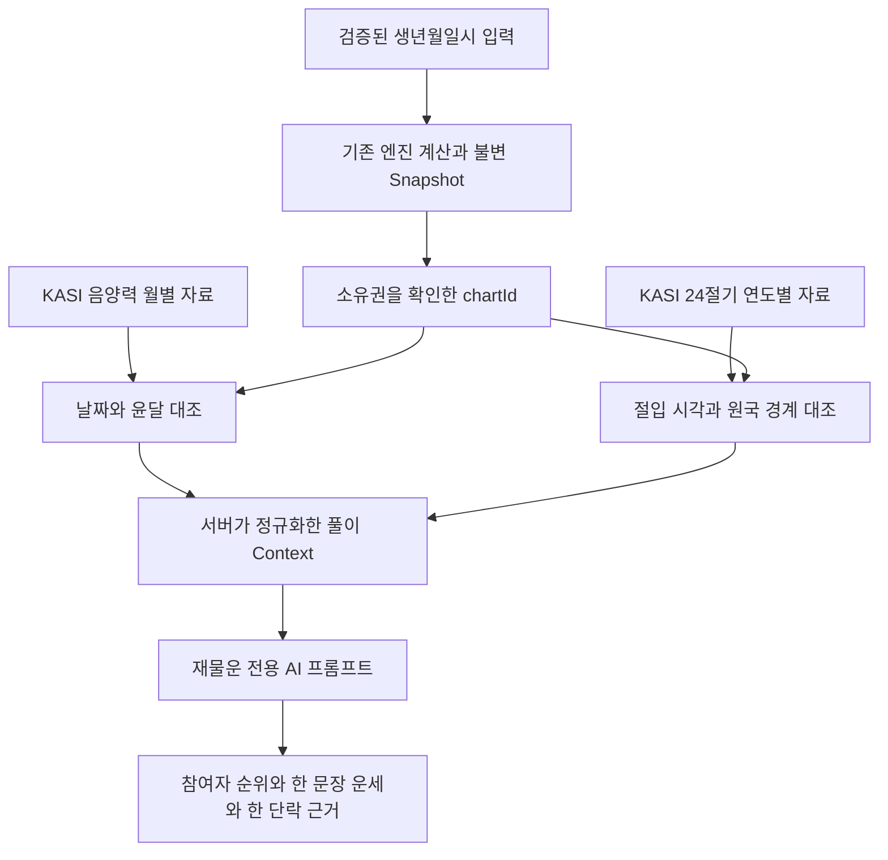

# 선녀 사주 공공 API 연결 점검

> 2026-09-14 후속 구현: 특일 API 대조와 재물운 분석을 추가한 현재 동작은 [재물운 KASI 연결 문서](./wealth-ranking-kasi.md)를 기준으로 한다. 아래 내용은 해당 후속 구현 전의 기록을 포함한다.

점검일: 2026-09-14

음양력정보는 양력·음력·윤달을 확인하고, 특일정보의 **24절기 조회**는 절기가 들어오는 시각을 확인하는 데 사용한다. 기존 `manseryeok@2.0.0`으로 원국을 계산하고, KASI 자료로 계산에 쓰인 달력과 경계를 검증한 뒤 상품별 AI 프롬프트에 정규화한 사실을 전달하는 구성을 권장한다.

현재 서버에는 음양력 대조가 구현되어 있다. 특일정보 조회와 절기 대조는 아직 구현되어 있지 않다. 두 API의 활용신청을 완료했다고 해서 두 기능이 모두 켜지는 것은 아니다. 이번 작업은 문서·코드 점검과 오프라인 검증이며, 운영 코드·환경변수·DB·공개 API는 변경하지 않았다.

## 첨부 가이드에서 확인한 API 계약

사용자가 제공한 음양력 정보제공 서비스 v1.1과 특일 정보제공 서비스 v1.4의 오퍼레이션 명세와 응답 예제를 확인했다. 문서의 표·예제에서 확인한 정보이며, 실제 인증 요청 성공을 의미하지 않는다.

| 구분 | 음양력정보 | 특일정보 |
| --- | --- | --- |
| 서비스 | `LrsrCldInfoService` | `SpcdeInfoService` |
| 이번 목적의 메서드 | `getLunCalInfo` | `get24DivisionsInfo` |
| 입력 | `solYear`, `solMonth`, 선택적 `solDay`, `ServiceKey` | `solYear`, 선택적 `solMonth`, `ServiceKey` |
| 주요 출력 | 양력·음력 날짜, `lunLeapmonth` | `dateName`, `locdate`, `kst`, `sunLongitude`, `dateKind` |
| 응답 형식 | 가이드 기준 XML | 기본 XML, `_type=json` 지원 |
| 사주에서의 역할 | 생일의 달력 변환·윤달 대조 | 입춘과 12절 경계의 날짜·시각 대조 |

포털의 endpoint는 서비스의 기본 주소다. 실제 조회에는 그 뒤에 메서드 이름을 붙이고 날짜와 인증키를 쿼리 파라미터로 전달한다. 키를 `Authorization: Bearer` 헤더에 넣는 방식이 아니다.

```text
음양력 조회
https://apis.data.go.kr/B090041/openapi/service/LrsrCldInfoService/getLunCalInfo

24절기 조회
https://apis.data.go.kr/B090041/openapi/service/SpcdeInfoService/get24DivisionsInfo
```

첨부 문서에는 HTTP 주소가 적혀 있다. 현재 음양력 adapter는 HTTPS 주소를 사용한다. 신규 특일 adapter도 HTTPS로 연결하고, 인증 요청으로 통신 가능 여부를 검증해야 한다.

권장 요청 파라미터는 다음과 같다. 실제 키가 포함된 URL을 로그나 문서에 남기지 않는다.

| 조회 | 파라미터 예시 |
| --- | --- |
| 양력 한 달에 해당하는 음력 | `solYear=2015`, `solMonth=01`, `numOfRows=31`, `pageNo=1`, `ServiceKey=<음양력 인증키>` |
| 한 해의 24절기 | `solYear=2019`, `numOfRows=100`, `pageNo=1`, `ServiceKey=<특일 인증키>` |

월 또는 연 단위로 가져오면 같은 시기에 태어난 참여자들이 자료를 재사용할 수 있다. 기본 페이지 크기가 10이므로 응답의 `totalCount`와 실제 항목 수를 확인해야 한다. 24절기 조회가 빈 목록을 반환하면 해당 연도를 검증했다고 표시하지 않는다. 과거 출생연도와 미래 연도의 제공 범위는 실제 응답으로 별도 확인해야 한다.

## 지금 입력할 환경변수

음양력정보에 발급된 일반 인증키를 **서버 루트 `.env`의 기존 `KASI_SERVICE_KEY`**에 입력한다. 키 입력 후 활성화하고 서버를 재시작한다.

```dotenv
KASI_SERVICE_KEY=
KASI_CALENDAR_VERIFICATION_ENABLED=true
KASI_TIMEOUT_MS=2000
```

빈 `KASI_SERVICE_KEY`에 본인의 키를 입력해야 한다. 위 상태 그대로 키 없이 활성화하면 시작 시 설정 검증에서 실패한다. Decoding 키를 권장하며, 현재 코드는 Encoding 키도 한 번 디코딩한 뒤 요청 시 인코딩한다. 프론트엔드 환경변수나 AI 모델 설정에 넣지 않는다.

현재 음양력 endpoint는 adapter에 지정되어 있어 `.env`에 endpoint를 추가할 필요가 없다. 임의의 `KASI_ENDPOINT`를 넣어도 현재 코드는 읽지 않는다.

특일정보는 신규 adapter를 구현할 때 다음 설정을 추가하는 것이 적절하다. **아래 이름은 제안이며 현재 지원되는 환경변수가 아니다.**

```dotenv
# 특일 adapter 구현 시 추가할 설정안
KASI_SPECIAL_SERVICE_KEY=
KASI_SOLAR_TERMS_VERIFICATION_ENABLED=false
```

각 키가 다르면 각 서비스에 해당하는 키를 사용한다. 두 값이 같아도 서비스별 활용신청 승인 여부를 각각 확인한다. 기존 `KASI_SERVICE_KEY`의 의미를 바꾸지 않고 유지하면 현재 설정과 호환된다. endpoint는 비밀정보가 아니므로 두 서비스 주소를 향후 `src/config/kasi-api.config.ts`에 모아 관리할 수 있다. 새 키는 환경변수 schema와 `.env.example`에 함께 추가한다.

## 웹에서 확인한 구현 사례

아래는 개발자 본인의 글과 프로젝트 문서를 근거로 확인한 사례다. 상용 서비스의 내부 운영 코드나 정확도를 검증한 것은 아니며, 모두가 두 공공 API를 요청마다 실시간 호출한다고 주장하지 않는다.

| 사례 | 확인한 구현 방식 | 선녀 사주에 적용할 판단 |
| --- | --- | --- |
| [즐거운 사주 개발자의 라이브러리 공개 글](https://www.fullstackfamily.com/boards/free/posts/382), [urstory/manseryeok-js](https://github.com/urstory/manseryeok-js) | 개발자는 사주 서비스 개발 중 KASI 데이터를 사용한 라이브러리를 만들었다고 설명한다. 라이브러리는 달력 데이터를 내장한다. | 공통 달력 자료를 재사용해 외부 요청과 저장소 부하를 줄인다. |
| [ManSeaYuk1](https://github.com/ksoh777-droid/ManSeaYuk1) | README는 KASI 기반 `@fullstackfamily/manseryeok`에서 추출한 데이터를 웹앱에 내장하고, AI 풀이는 별도 로컬 서버에서 제공한다고 설명한다. | 원국 계산과 AI 해석의 책임을 분리한다. 이 프로젝트의 엔진은 현재 사용하는 `manseryeok`와 다른 패키지다. |
| [korean_saju](https://github.com/glee1228/korean_saju) | 음양력·절기 데이터를 내장하고 데이터 범위 밖의 절기는 계산으로 보완한다고 설명한다. | 공식 자료가 있는 범위와 계산으로 보완하는 범위를 구분한다. |
| [oh-my-saju](https://github.com/JaeSang1998/oh-my-saju/blob/main/README.md), [자료 출처 기록](https://github.com/JaeSang1998/oh-my-saju/blob/main/NOTICE.md) | KASI·data.go.kr 자료를 고정된 회귀 검증 자료로 사용하고, 런타임 달력 변환은 내부 계산기로 수행한다고 명시한다. | 외부 API 장애가 계산 재현성을 흔들지 않도록 공식 응답을 독립 fixture로 보관한다. |

`@fullstackfamily/manseryeok`에는 과거 음력 월초와 사주 월주 경계의 차이를 다룬 [이슈](https://github.com/urstory/manseryeok-js/issues/5)가 있고, README는 v1.0.7의 절기 기준 월주 수정을 명시한다. 현재도 같은 버그가 있다는 의미는 아니다. KASI 기반이라는 출처만으로 모든 사주 계산 정책이 검증되는 것은 아니라는 참고 사례다.

이번 점검은 기존 [yhj1024/manseryeok](https://github.com/yhj1024/manseryeok) 엔진을 교체할 근거를 발견한 작업이 아니다. 다른 프로젝트의 자시·경도·균시차 정책을 기존 Snapshot에 섞지 않는다.

## 현재 서버 점검 결과

| 항목 | 현재 상태 | 후속 작업 |
| --- | --- | --- |
| 음양력 대조 | `KasiCalendarProvider`가 양력 한 달을 조회해 저장 Snapshot의 음력 날짜와 윤달 여부를 비교 | 실제 인증 호출과 독립 공식 fixture 추가 |
| 인증키 처리 | ConfigService·Zod 검증, Encoding/Decoding 지원 | 신규 특일 키에도 같은 정책 적용 |
| 응답 검증 | XML·응답 코드·달력 월의 완전성 검사, 시간·크기 제한 | 특일은 별도 응답 schema 필요 |
| 재사용 | 월별 메모리 cache 24시간, 동시 동일 요청 합치기 | 절기 자료도 연도별 cache, 필요 시 버전 있는 영속 자료로 확장 |
| 실패 정책 | 조회 불가 시 `unavailable`로 풀이 계속, 실제 달력 불일치 시 AI 전에 409 중단 | 절기 차이가 연주·월주에 영향을 주는 경우와 단순 미조회 구분 |
| 사주 경계 | 엔진의 절기 자료로 계산하며 시간 미상인 12절 경계일은 등록 거절 | KASI 절기 시각과 독립 대조 추가 |
| AI 입력 | 원국·십성·오행 구성·지장간·삼합·달력 대조 상태 제공 | 절기 대조 범위와 불확실성만 명시적으로 추가 |
| 시기별 해석 | `periodContext: null`; 올해 운세·현재 대운 예측 금지 | 연·월 운세 상품 구현 때 기준일과 시기 계산 정책 도입 |

관련 코드: [달력 adapter](../src/modules/readings/infrastructure/kasi-calendar.provider.ts), [환경변수 schema](../src/config/environment.schema.ts), [차트 계산](../src/modules/saju-profiles/saju-chart-calculator.ts), [역사 시각 보정](../src/modules/saju-profiles/korean-birth-time.ts), [풀이 서비스](../src/modules/readings/wealth-ranking.service.ts), [AI 입력](../src/modules/readings/wealth-ranking-context.ts), [상품 프롬프트](../src/modules/readings/infrastructure/wealth-ranking.prompt.ts).

## 사주 계산에 연결할 때 지켜야 할 경계

1. **음양력 API의 간지와 사주 원국을 자동 치환하지 않는다.** `lunSecha`, `lunWolgeon`, `lunIljin`을 반환해도 입춘 기준 연주, 12절 기준 월주, 서비스의 자시·시각 보정 정책을 대신할 수 없다. 현재 대조 범위인 양력·음력 날짜와 윤달부터 유지한다.
2. **특일정보에서는 `get24DivisionsInfo`를 우선 사용한다.** 공휴일·기념일·잡절은 현재 재물운 순위의 근거가 아니다. 공휴일 조회 `getRestDeInfo`를 연결해도 절입 시각 검증은 되지 않는다.
3. **절기 날짜와 시각을 함께 사용한다.** 가이드의 `locdate=20190306`, `kst=0610`은 한국표준시각 2019-03-06 06:10이라는 분 단위 표기다. `kst`의 공백과 앞자리 0을 처리하고 00~23시·00~59분을 검증한다. `dateKind=03`, 절기명과 황경의 대응도 확인한다. 분 단위 표기만으로 초 단위 정확도를 주장하지 않는다.
4. **24개 절기와 12개 월 경계를 구분한다.** 월주 경계는 입춘·경칩·청명·입하·망종·소서·입추·백로·한로·입동·대설·소한이다. 춘분·추분 같은 중기를 월주 전환으로 사용하지 않는다. 이 구분은 기존 엔진 정책과 동일하게 적용한다.
5. **같은 순간끼리 비교한다.** KASI 절입 시각과 출생 순간을 동일한 시간 기준으로 정규화한다. 출생시각에만 필요한 한국 평균태양시 보정을 절입 시각에 다시 적용하지 않는다. 역사 표준시·서머타임 입력은 기존 `resolveKoreanBirthTime` 정책을 유지하고, 오래된 KASI 자료의 시각 기준은 자료 범위와 함께 확인한다.
6. **결과가 바뀌는 경계는 숨기지 않는다.** 공식 시각과 엔진 시각의 차이가 원국을 바꾸면 AI 전에 중단·재계산 안내를 제공하는 정책이 필요하다. 허용 오차와 경계 판정 규칙은 구현 시 버전으로 고정한다. 기존 Snapshot을 외부 응답으로 덮어쓰지 않는다.

## 권장 연결 흐름



그림의 절기 자료와 절기 대조 단계는 추가 구현안이다. 원국 계산은 이미 절기를 사용한다. KASI 특일정보는 그 계산 경계를 대조하는 자료로 도입하는 것이 현재 구조에 적합하다.

새 Context에는 `solarTermVerification`처럼 달력 대조와 구별되는 필드를 두고, 자료 범위·대조 상태·정밀도·경계 불확실성을 넣는 방식을 권장한다. 전체 XML, 인증키, endpoint, 이름·생일 원문은 AI에 전달하지 않는다. 실제 자료를 구하지 못한 경우 상태를 명시하고, 검증되었다고 서술하지 않게 한다.

원국 기준 재물운 랭킹에는 절기 검증 성공 자체를 가산점으로 쓰지 않는다. 동일한 원국이 확인됐다면 KASI 연결 전후의 비교 근거도 같은 사실을 사용해야 한다. 올해·월별 재물운을 추가할 때는 별도로 기준 기간과 해당 기간의 간지, 필요한 대운 정보를 계산해야 한다. 단순히 올해 절기 목록을 프롬프트에 넣는 것으로 시기별 풀이가 완성되지는 않는다.

## 검증 결과와 적용 순서

첨부 문서의 예제와 현재 설치된 `manseryeok@2.0.0`을 오프라인으로 대조했다.

| 예제 | 문서의 값 | 현재 엔진 | 결과 |
| --- | --- | --- | --- |
| 2015-01-01 양력 | 2014-11-11 음력 평달 | 동일 | 일치 |
| 2019년 경칩 | 2019-03-06 06:10 KST | `2019-03-05T21:10:00.000Z` | 일치 |
| 2019년 춘분 | 2019-03-21 06:58 KST | `2019-03-20T21:58:00.000Z` | 일치 |

이는 가이드 예제 3건에 한정한 일치다. 전체 출생연도, 현재 API 가용성, 사주 해석의 정확도를 보증하는 결과는 아니다. 기존 KASI adapter 테스트의 월별 XML은 엔진에서 생성한 합성 fixture이므로 통신 처리 검증에 해당한다. 실제 공식 응답을 고정한 독립 fixture로 보완해야 한다.

관련 unit test 4개 파일, **62개 테스트가 통과**했다. 실행 명령:

```bash
npm test -- src/modules/readings/infrastructure/kasi-calendar.provider.spec.ts src/config/environment.schema.spec.ts src/modules/readings/wealth-ranking.spec.ts src/modules/saju-profiles/saju-chart-calculator.spec.ts
```

이번 변경은 이 점검 문서뿐이므로 lint·전체 unit test·e2e·build는 재실행하지 않았다. 실제 인증키를 사용한 공공 API 호출과 Kie AI 호출도 수행하지 않았다. 기존 공개 API와 DB의 변경·migration은 없다.

후속 구현 순서는 다음과 같다.

1. 음양력 키 등록 후 공개 예제 날짜로 HTTPS 호출, 승인 상태와 `resultCode=00` 확인. 평달·윤달·월 전체 응답을 독립 fixture로 고정한다.
2. 특일 키와 활성화 flag를 검증하는 설정, `get24DivisionsInfo` adapter와 연도별 cache를 구현한다. 운영 지원 출생연도의 응답 범위를 먼저 확인한다.
3. 입춘·12절 전후, 시각 미상, 자정, 역사 표준시·서머타임, 자료 미제공 사례로 기존 엔진과 대조한다. 응답 오차·경계 불일치의 처리 정책을 고정한다.
4. 프롬프트 버전을 올려 대조 범위와 불확실성을 반영한다. 공개 오류 reason을 추가하면 OpenAPI·contract test와 consumer 호환성도 함께 확인한다.
5. 실제 2~5명 랭킹에서 참여자 누락·중복 없이 순위, 한 문장 운세, 한 단락 근거가 반환되는지 확인한다.

공식 서비스 페이지: [음양력정보](https://www.data.go.kr/data/15012679/openapi.do), [특일정보](https://www.data.go.kr/data/15012690/openapi.do). 기존 데이터 조합 정책은 [사주 풀이 데이터 조합 문서](./saju-reading-data-combination.md)를 참고한다.
