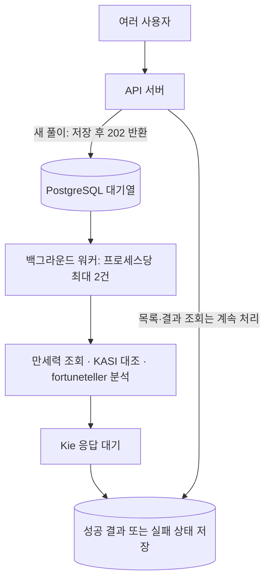

# 풀이 동시 처리와 배포 용량 점검

2026-09-14. 코드, 실제 요청 로그, 소규모 동시 조회를 점검했다. 현재 구현은 **AI 응답을 기다리는 동안 다른 HTTP 요청을 처리할 수 있고, 풀이 실행은 프로세스당 2건으로 제한하는 DB 대기열 구조**다. 대규모 사용자의 풀이를 일정 시간 내에 모두 완료할 수 있다는 검증은 아직 없다.

## 실제 확인한 동시 응답

19:23:27~19:28:27 Kie 요청이 대기하던 중, 사용자가 제공한 19:24:45~19:28:24 로그에는 아래 응답이 남았다.

| 요청 | 개수 | 응답 | 최대 시간 |
| --- | ---: | --- | ---: |
| GET /v1/reading-jobs | 51 | 모두 200 | 179ms |
| GET /v1/reading-results/:jobId | 7 | 모두 200 | 112ms |
| GET /v1/users/me | 9 | 모두 200 | 190ms |
| GET /v1/reading-products | 2 | 모두 200 | 1ms |
| OPTIONS | 67 | 모두 204 | 3ms |

19:34:56에는 기존 공개 결과 하나에 GET 20건을 한 번에 보냈다. 모두 200이며 요청별 190~210ms, 중앙값 200.5ms, P95 208ms, 전체 묶음 225ms였다. 로컬 Nest 서버와 설정된 DB를 사용했다. 인증·AI 생성·DB 쓰기·새 작업 생성은 하지 않았다. 이 수치는 단 한 번의 소규모 읽기 확인이며 배포 서버의 지속 RPS나 AI 작업 처리량으로 환산할 수 없다.

## 현재 흐름과 제한

한 건은 2~5명 그룹의 재물운 풀이 하나다. 그룹 참여자 수와 요청자 수는 다르다.

| 항목 | 현재 구현 | 근거 |
| --- | --- | --- |
| 새 풀이 접수 | DB 저장 후 HTTP 202, 접수 시 AI 호출 없음 | reading-jobs.controller.ts, reading-jobs.service.ts |
| 백그라운드 동시 실행 | 프로세스당 최대 2건, 2초마다 빈 자리 확인 | reading-jobs.worker.ts의 CONCURRENCY, tick |
| 같은 사용자 | queued/running 합계 1건, 신규 접수 분당 3건 | 사용자 행 잠금·DB 부분 unique index·ReadingRequest 집계 |
| 다른 사용자 | 접수 가능, 빈 실행 자리가 없으면 queued | ReadingJobsService.create |
| 요청 재전송 | 같은 사용자·키·입력은 기존 작업 반환 | ReadingRequest 및 멱등 처리 |
| 다중 워커 중복 점유 | 조건부 UPDATE + lease ID로 방지 | claimNext, process |
| 장애 복구 | 준비 중은 재대기, AI 시작 후 불명확한 중단은 실패 | recoverExpired |
| API와 워커 실행 환경 | 기본적으로 같은 Nest 프로세스·DB pool 공유 | AppModule, PrismaService |
| AI 생성 서비스의 별도 한도 | 프로세스당 최대 4건, 같은 사용자 1건 | WealthRankingService.inFlight |
| 전역 큐 길이·대기시간 상한 | 없음 | 접수·선점 경로에 제한 없음 |

`await fetch`로 외부 응답을 기다리는 시간 동안 이벤트 루프는 다른 요청을 처리할 수 있다. 다만 백그라운드라는 이름이 별도 CPU 스레드나 프로세스를 뜻하지는 않는다. 현재 만세력·fortuneteller의 동기 계산이나 큰 JSON 처리에 오랜 CPU 시간이 들면 같은 프로세스의 응답도 영향을 받는다. 이번 측정에서는 fortuneteller 2명 분석이 4ms였지만 대규모 부하 상황의 수치는 아니다. [Node.js 공식 설명](https://nodejs.org/learn/asynchronous-work/dont-block-the-event-loop)

AI 응답을 기다리는 동안 DB transaction을 계속 열어 두지 않으며, 10초마다 lease를 갱신하는 짧은 DB 작업을 수행한다. 장시간 Kie 연결이 DB 연결을 한 개씩 5분간 독점하는 구조는 아니다.

## 사용자가 몰리면 얼마나 기다리는가

단일 워커 프로세스, 동시 실행 2건, 동일한 작업 시간, 추가 유입·DB/폴링 지연이 없다고 가정한 계산이다. 실제 처리량을 보증하는 측정값이 아니다.

| 작업 하나가 실행 자리를 차지하는 시간 | 이론상 분당 처리 종료 건수 | 서로 다른 사용자 100명이 동시에 요청했을 때 마지막 작업 종료 |
| --- | ---: | ---: |
| 15초 | 약 8건 | 약 12분 30초 |
| 60초 | 약 2건 | 약 50분 |
| 300초 | 약 0.4건 | 약 4시간 10분 |

계산은 `분당 처리 종료 = 동시 실행 수 × 60 / 작업 초`, `마지막 종료 = ceil(요청 수 / 동시 실행 수) × 작업 초`다. 실패도 그 시간 동안 실행 자리를 사용한다. 최근 524처럼 종료된 작업은 성공 결과를 제공하지 못하므로 처리 종료 건수와 성공 건수를 구분해야 한다.

예를 들어 10명 요청이면 2건 실행·8건 대기이며, 빈 자리가 나면 다음 작업을 실행한다. 유입 속도가 완료 속도보다 계속 빠르면 대기열과 대기시간이 계속 늘어난다. 10분 설정은 **AI 호출 실행 제한**이며 대기열에서 기다린 시간의 상한이 아니다.

## 배포 전 보완 우선순위

### 1. Kie 지연과 전역 생성 한도

최근 3명 요청은 300.1초 후 Kie HTTP 524로 실패했다. 동시 실행 수만 늘리면 장시간 대기 중인 유료 외부 호출이 늘 수 있다. 우선 공급자 지연·524 비율·실제 계정 한도·요청당 비용을 확인하고 성공 응답 시간을 안정화해야 한다.

현재 2건은 코드의 지역 상수이며 전역 제한이 아니다. 워커가 켜진 프로세스 5개를 띄우면 큐 경로의 실행 수는 최대 10건으로 늘어난다. 여러 서버가 같은 Kie 계정을 쓰면 계정 기준으로 합산 관리해야 한다. 동시 실행 설정을 환경변수로 노출하더라도 `WealthRankingService`의 별도 4건 상한과 함께 맞춰야 한다. 2만 10으로 바꾸면 5번째부터 서비스에서 거절될 수 있다.

[Kie 공통 안내](https://docs.kie.ai/)에는 계정별 생성 요청 제한이 있지만, [현재 Gemini chat-completions 계약](https://docs.kie.ai/market/gemini/gemini-3-8-flash-openai)은 일반 task_id 기반 생성 API와 형태가 다르다. 공통 안내의 동시 작업 수를 이 모델의 보장값으로 사용하지 않는다. 해당 엔드포인트·계정 한도를 확인한 뒤 늘린다.

### 2. 대기열 접수 제어 및 가시성

현재 사용자별 제한은 있지만 전체 queued 개수·최대 대기시간·전역 접수율·일일 생성 비용 상한은 없다. 큐가 포화되면 일시적으로 신규 접수를 제한하거나 예상 대기 안내를 제공해야 한다. `queued/running` 수, 가장 오래 기다린 작업의 시간, 큐 대기 P95, AI 응답 P95, 429/524/검증 실패율, lease 만료를 운영 지표로 수집한다. 현재는 요청별 로그만으로 추적한다.

### 3. API와 워커의 운영 분리

API 인스턴스의 `READING_JOBS_WORKER_ENABLED=false`는 이미 지원한다. 별도 상시 실행 워커 인스턴스에 true를 두어 API 증설과 AI 동시 실행 증가를 분리할 수 있다. 현재 전용 워커 부트스트랩은 없으므로 true 인스턴스도 Nest HTTP 앱을 실행한다. API와 워커는 DB 자원을 계속 공유하므로 분리만으로 DB 병목이 없어지는 것은 아니다.

조건부 선점은 중복 실행 방지의 기초가 있지만, 여러 워커가 같은 첫 queued 작업을 고르면 선점 실패 워커는 다음 2초 tick까지 기다린다. 워커를 많이 늘릴 때는 선점 경합과 처리 공정성도 부하 검증 대상이다. AI 이후 프로세스 장애는 자동 복구 성공을 보장하지 않으므로 무조건 자동 재시도를 추가하지 않는다.

### 4. 반복 조회·인증·DB 비용

- 결과·내 목록은 진행 중일 때 약 3초마다 조회한다. 소개/입력의 `ReadingStartGate`는 미완료 작업이 없어도 화면이 활성 상태인 동안 3초 조회가 설정되어 있다.
- 1,000개 활성 화면이 각각 한 번씩 3초마다 조회한다고 가정하면 상태 조회만 약 333 GET/초다. 별도의 OPTIONS·포커스 복귀·다중 탭·페이지 추가 조회는 포함하지 않은 계산이다.
- 인증이 필요한 내 목록 조회는 매번 Supabase `/auth/v1/user`를 호출한다. 공개 결과 GET에는 이 인증 guard가 없다. 상태 조회를 가볍게 만들고 대기시간별 간격 조정·포커스 복귀 조회 등으로 불필요한 호출을 줄이는 것이 우선이다. 인증 검증을 생략하는 방식으로 줄이지 않는다.
- PrismaPg는 별도 pool 크기 설정 없이 `pg.Pool`을 만든다. 설치된 pg 기본 max는 10이며, pool이 모두 사용 중이면 다음 요청은 연결을 기다린다. [node-postgres pool 문서](https://node-postgres.com/apis/pool) 서버 프로세스 수를 늘릴 때 Supabase pooler/DB의 실제 한도와 총 연결 수를 함께 맞춰야 한다. 계정 요금제·배포 서버 사양별 한도는 이번에 확인하지 않았다.
- 공개 결과는 `no-store`이며 매번 DB에서 조회한다. 완료 결과 캐시를 도입한다면 이름 변경·프로필 삭제에 따른 공개 결과 회수 정책도 보존해야 한다.

### 5. 기존 동기 API와 대기열 정책 통일

deprecated인 `POST /v1/readings/wealth-ranking`도 여전히 호출 가능하다. 이 경로는 DB 대기열을 통하지 않고 같은 생성 서비스를 직접 사용하며, 사용자 분당 제한은 프로세스 메모리 기준이다. 동기 호출이 실행 자리를 점유하면 백그라운드 작업도 생성 서비스의 4건 한도나 동일 사용자 제한에 걸려 실패할 수 있다.

배포 전 기존 소비자 호환성을 확인하고 이 경로의 접근을 제한하거나 계약 전환 후 비활성화해야 한다. 현재 화면은 `/v1/reading-jobs`를 사용한다. 공개 API를 이번 점검에서 변경하지는 않았다.

## 검증 범위와 다음 검증

이번 작업은 문서화와 읽기 확인만 수행했다. 실행 코드·설정·API·DB schema 변경은 없고 신규 AI 과금 호출도 없다. 따라서 lint/build 재실행과 migration은 필요하지 않다.

기존 `test/reading-jobs.integration-spec.ts`에는 AI 응답 대기 중 상태 조회, 동시 멱등 접수, 단독 점유와 복구 검증이 있다. 테스트 코드 존재와 실제 배포 부하 검증은 다르며 이번에 DB 통합 테스트를 다시 실행하지 않았다.

대규모 운영 가능 여부를 확정하려면 배포와 유사한 별도 환경에서 합성 사용자와 지연 가능한 AI 대역을 사용해 100/500/1,000 동시 조회 및 접수를 측정해야 한다. 이어서 계정 제한 이내의 소수 실제 AI 호출로 대역 결과와 차이를 확인한다. 새 접수 응답 시간, 큐 대기시간, 성공 처리량, 오류율, DB pool 대기, CPU·메모리·이벤트 루프 지연을 함께 보고 목표 트래픽을 정한다.
