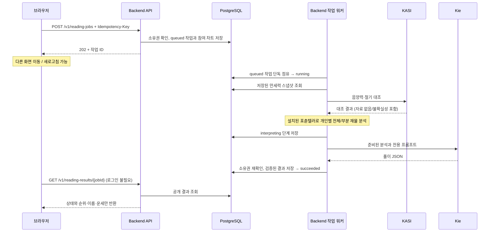

# 사주 풀이 백그라운드 작업

풀이를 HTTP 연결과 분리한다. 요청·상태·최종 결과는 PostgreSQL에 저장하며, 브라우저가 닫히거나 페이지를 이동해도 서버 작업은 계속된다. 현재 구현된 상품은 무료 `wealth-ranking`이다. 앞으로 추가할 개인 상세·전생·취업 풀이도 이 작업 API와 워커를 사용한다. 유료 상품은 결제/이용권 검증을 접수 트랜잭션에 연결한 뒤 지원 상품으로 추가한다.

## 요청 흐름

`preparing`은 만세력 조회·KASI 대조·로컬 분석, `interpreting`은 AI 문장 생성, `saving`은 결과 검증/저장이다. 퍼센트 진행률을 임의로 만들지 않는다. 실패하면 `failed`, 성공하면 `succeeded`이며 둘 다 `stage=finished`다.

## API 계약

- `POST /v1/reading-jobs`: `{ "productCode": "wealth-ranking", "chartIds": ["…", "…"] }`, 필수 `Idempotency-Key: UUID`. `202`로 작업 상세를 반환한다. 접수 과정에서는 KASI/Kie를 호출하지 않는다.
- `GET /v1/reading-jobs/{jobId}`: 본인 작업 상세와 `result`. 성공할 때만 결과가 존재한다. 실패 시 안전한 `error.reason/message`를 반환하며 제공자 원문은 노출하지 않는다.
- `GET /v1/reading-jobs?limit=20&cursor=…`: 최신순 목록. 본문이 큰 결과는 제외한다. `nextCursor=null`이면 마지막 페이지다. limit은 1~50.
- `GET /v1/reading-results/{jobId}`: 로그인 없이 기존/신규 작업 UUID로 상태와 공개 결과를 조회한다. 성공 결과는 `ranking[{rank, displayName, fortune}]`, `rationale`, `comparisonTitle`, 일반 `notice`만 포함한다. 대기/처리 중에는 `result=null`, 실패 시에는 일반 실패 문구만 반환한다. 차트 ID, 생년월일시, 원국, quality/warnings, 소유자 ID, 내부 오류 원문은 제외한다.
- 작업 접수·내 목록·소유자 상세 API의 인증은 유지한다. 공개 결과도 활성 소유자와 삭제되지 않은 참여자만 조회하며 모든 응답은 envelope·`no-store`·`x-request-id` 정책을 따른다. 전체 공개 결과를 열거하는 목록 API는 제공하지 않는다.
- 기존 `POST /v1/readings/wealth-ranking`은 이전 consumer 호환을 위해 동기 계약을 유지하고 OpenAPI에 deprecated로 표시했다. 새 프론트엔드는 이 경로를 호출하지 않는다. 모든 신규 풀이 구현은 작업 API에 연결한다.

같은 사용자·같은 키·같은 입력은 생성 시점과 관계없이 같은 작업을 반환한다. 다른 입력으로 키를 재사용하면 `409 IDEMPOTENCY_KEY_REUSED`다. 같은 사용자의 미완료 작업은 DB 부분 unique index로 1개만 허용하며 신규 접수는 분당 3건이다. 기존 키 재조회는 이 한도를 소모하지 않는다. 실패 후 다시 풀이하려면 사용자가 새 요청 키로 명시적으로 요청한다.

## 실행과 복구

Redis 등 새 인프라 없이 현재 PostgreSQL을 큐로 사용한다. 상시 실행 Nest 인스턴스가 2초 간격으로 확인하며 인스턴스당 최대 2건을 처리한다. 다중 인스턴스의 동시 점유는 조건부 UPDATE와 lease UUID로 차단한다. 인증 토큰을 작업에 저장하지 않으며, 서버가 저장된 사용자와 차트 소유권을 다시 검사한다.

- lease는 60초, heartbeat는 10초다.
- 대기 작업은 서버 재기동 후 처리된다.
- `preparing`에서 lease가 만료되면 다시 대기열에 넣는다. AI 호출 직전에 `interpreting` 저장이 성공해야 하므로 이전 워커가 점유를 잃은 뒤 AI를 시작하지 못한다.
- `interpreting`/`saving` 중 lease 만료는 `READING_INTERRUPTED`로 종료한다. 외부 AI는 이미 처리했을 수 있어 자동 재호출하지 않는다. Kie가 멱등 작업 생성/결과 조회를 제공하지 않는 현재 호출 방식에서는 서버 강제 종료와 외부 응답 사이의 exactly-once 결과 복구를 보장할 수 없다.
- 일반 제공자 실패·출력 검증 실패는 `READING_FAILED`, 제한시간 초과는 `READING_TIMEOUT`, 역법 대조 충돌은 `SAJU_REFERENCE_CONFLICT`로 저장한다.
- 브라우저 이탈은 취소가 아니다. 강제 종료로 잃은 호출의 과금 취소를 보장하지 않는다.

프로필 삭제는 그 프로필이 참여한 작업 전체와 결과를 같은 트랜잭션에서 삭제한다. `ReadingRequest`는 입력 hash만 남기고 작업 FK를 null로 만들어, 지워진 요청을 재전송해도 `410 READING_DELETED`로 응답한다. 탈퇴하면 작업/결과/요청 hash까지 지운다. 완료 저장도 동일 사용자 행 잠금을 사용하므로 삭제 뒤 결과가 다시 생성되지 않는다. 표시 이름 수정은 재계산 없이 조회 시 반영한다.

## 실행 설정과 배포

1. 서버 코드 배포 전에 `npm run prisma:migrate:deploy`와 `npm run prisma:generate`를 실행한다. 새 migration은 `20260914100000_create_reading_jobs`이며 기존 데이터 변경 없이 작업·참여자·멱등 요청 테이블을 추가한다. Supabase 브라우저 역할 접근은 RLS와 권한 회수로 차단한다.
2. `.env`의 `READING_JOBS_WORKER_ENABLED=true`가 기본값이다. API 전용 인스턴스는 false로 둘 수 있지만 적어도 하나는 true로 **계속 실행**되어야 한다.
3. Nest 서버를 재시작한 뒤 프론트엔드를 배포한다. `WEALTH_RANKING_ENABLED`, 기존 Kie/KASI 키와 모델 설정은 그대로 사용한다.
4. 컨테이너/VM 상시 프로세스에 적합하다. 요청 종료 시 프로세스가 정지하는 서버리스 API에 현재 워커를 단독 배치하면 안 된다. 이 경우 별도 상시 워커 실행 환경이 필요하다.
5. `WEALTH_RANKING_TIMEOUT_MS`는 AI 실행 제한(기본/최대 300초)이며 접수 HTTP 응답 대기시간이 아니다. 작업은 접수부터 대기·준비·저장을 포함한 300초 예산을 공유한다. [프롬프트와 시간 제한 설정](./wealth-ranking-prompt-v8.md)을 참고한다.

운영 로그는 `reading_job_accepted/started/progress/succeeded/failed`와 `reading_jobs_recovered`를 제공한다. `jobId`로 작업을, `requestId`로 접수와 KASI/Kie 기존 로그를 연결한다. 이름·출생정보·프롬프트·토큰·원본 제공자 응답을 일반 로그에 저장하지 않는다. `reading_job_worker_unavailable` 반복 시 DB 연결/마이그레이션과 워커 실행 상태를 확인한다.

## 프론트엔드

풀이 탭과 재물운 참여자 선택 화면에 `내 풀이` 목록을 표시한다. 요청 접수 후 `/readings/jobs/{jobId}`로 이동한다. 이 결과 URL은 로그인 없이 공개 조회 API를 호출하며, 진행 중인 작업만 약 3초 간격으로 조회하고 완료/실패 시 반복 조회를 멈춘다. 재접속·창 포커스 복귀 시 서버에서 최신 상태를 조회한다. 내 목록/상세 캐시는 사용자 ID로 구분하고 공개 결과 캐시는 UUID로 구분한다.

재물운 소개와 참여자 입력 페이지는 인증 상태 확인 후 서버 목록의 첫 페이지에서 미완료 작업을 확인한다. 사용자당 미완료 작업은 하나이고 최신순이므로 첫 페이지에 포함된다. 진행 중이면 시작 버튼/입력 폼 대신 단계와 기존 결과 링크를 표시한다. 이 조회는 약 3초 간격과 창 포커스 복귀 때 갱신한다. 캐시가 비어 있어도 이번 방문의 조회가 끝나기 전에는 새 시작 UI를 표시하지 않는다. 조회 실패 때도 새 요청을 열지 않고 상태 확인 버튼을 표시한다. 완료되면 시작 UI가 다시 열린다.

결과 화면은 이름·순위·운세·비교 설명만 표시하며 개인별 계산 경고/시간 미상 배지와 `다시 해보기` 버튼을 제거했다. 시간 미상에 대한 분석 범위와 경고는 내부 계산/저장 계약에 그대로 유지한다. 공개 결과의 일반 안내는 입력 정보 범위에 따라 해석이 달라질 수 있음을 알린다.

접수 응답이 불명확한 경우 같은 참여자에 대한 멱등 키를 sessionStorage에 잠시 유지하여 새로고침 뒤 명시적 재시도도 기존 작업을 확인하게 한다. 입력 중인 미접수 폼까지 서버에 저장하는 기능은 포함하지 않는다. 새 풀이 접수에는 로그인이 필요하지만 기존 결과 링크는 로그인 화면을 거치지 않는다. 오류가 나도 새 풀이를 자동 요청하지 않는다.

## 검증

외부 AI/인증 제공자를 대역으로 교체한 HTTP + PostgreSQL integration test에서 접수/조회, 동시 멱등 요청, 단독 점유, 단계별 만료 복구, 삭제 중 완료 경합, 탈퇴 정리를 검증한다. 프론트엔드의 저장 결과 복원/상태 검증은 `pnpm test:reading-jobs`로 확인한다. 실제 Kie 호출에 의존하지 않는다.

## 기존 결과 공개 적용

기존 UUID를 그대로 공개 조회 식별자로 사용한다. 별도 공유 토큰, 공개 전환 컬럼, 기존 결과 JSON 재작성은 필요하지 않으며 이번 변경에 DB migration은 없다. 사주 프로필 삭제/탈퇴 시 결과를 함께 지우는 기존 정책과 DB RLS는 유지한다. 과거 저장 결과에서도 공개 필드를 명시적으로 새 객체에 매핑하므로 기존 계산 경고가 응답에 섞이지 않는다. 결과의 풀이 문장은 보존한다.

`test/reading-results.e2e-spec.ts`는 HTTP 경계에서 익명/만료 토큰 조회, 과거 결과 매핑, 공개 필드 제한, 단계별 상태 응답, 기존 인증과 소유권을 검증한다. Prisma와 외부 Provider를 대역으로 사용하며 실제 DB 통합 검증과 구분한다. `pnpm test:reading-jobs`는 상태 복원과 실제 React 컴포넌트 렌더링을 검증하고 `pnpm test:wealth-ranking`은 공개 결과 mapper를 포함한다.

2026-09-14 공개 조회 변경 검증: 서버 lint·unit 228개·HTTP e2e 97개·build, 프론트 lint·mapper/렌더링 44개·build를 통과했다. 실행 중인 서버의 기존 완료 결과에 인증 헤더 없이 GET하여 200과 공개 필드만 반환되는 것을 확인했고 같은 UUID의 소유자 상세는 401이었다. 브라우저의 기존 결과에서도 `다시 해보기`와 개인별 계산 경고가 없는 것을 확인했다. 이번 변경에서는 DB 쓰기나 새 AI 풀이를 실행하지 않았다.

## 재물운 비교 풀이와 AI 제목 (v7)

전체 2~5명 순위와 개인별 한 문장 운세는 유지한다. 비교 본문은 결과 배열의 첫 번째와 마지막 참여자 두 사람에 집중한다. AI가 두 사람의 재물 성향·강점·도움 되는 습관을 비교하고 그 내용에 맞는 `comparisonTitle`을 한 줄 60자 이내로 작성한다. 순위를 자산이나 사람의 가치로 단정하지 않으며, 동등한 입력에 억지 차이를 만들지 않는다. 시간 미상자의 개인별 분석 범위도 기존대로 유지한다.

모델 출력의 `comparisonTitle`은 필수다. `rationale` 원문은 한 단락 600자 이내이며 양 끝 참여자 키가 모두 포함되어야 한다. 중간 순위의 참여자나 근거 참조, 모르는 참조는 거절한다. 순위 전체의 참여자·근거 검증은 그대로 실행한다. AI 호출을 늘리거나 원국을 다시 계산하지 않는다.

이름은 AI에 전송하지 않는다. AI는 `{{pN}}님은`처럼 익명 참조를 사용하고 저장 시 검증된 순위 참조로 정규화한다. 공개 GET은 현재 프로필 이름을 연결해 `정재민님은`처럼 반환한다. 이름 변경도 재생성 없이 반영되며, 동명이인은 `정재민님(1위)`처럼 구분한다. 이름의 특수문자는 문법으로 재해석하지 않고 프론트가 일반 텍스트로 렌더링한다. 이름 치환으로 본문이 길어질 수 있어 공개 `rationale`의 최대 길이는 3600자다. 저장/모델 원문 600자 제한은 유지한다.

저장된 JSON에 선택 필드 `comparisonTitle`을 추가하므로 DB migration은 없다. 새 풀이의 제목은 AI 출력이며, 과거 결과는 본문을 보존하고 순위 호칭만 이름으로 바꾼다. 과거 결과의 제목은 `함께 살펴보는 재물의 흐름`이다. 과거의 여러 명 비교를 두 사람만의 새 해석으로 재생성하거나 기존 데이터를 일괄 덮어쓰지 않는다. 공개 API는 제목을 항상 제공하고, 기존 소유자 상세/호환용 동기 응답의 제목 필드는 과거 결과 호환을 위해 선택 필드다.

프론트는 `랭킹 산출 근거 / 이렇게 비교했어요` 대신 `재물운 비교 풀이 / AI 제목`을 표시한다. 기존 결과 링크, 공개 범위, 진행 상태 복원 정책은 유지된다. 배포 시 서버와 프론트의 새 필드·본문 길이 계약을 함께 반영한다. 프론트는 이전 API 응답에 제목이 없어도 기본 제목으로 표시한다.
