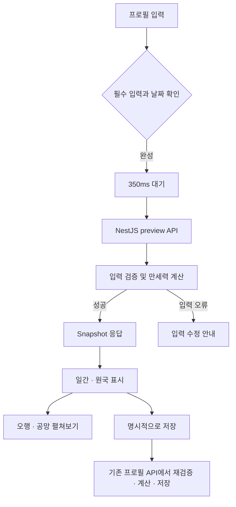

# 만세력 미리보기 계산과 표시

작성일: 2026-09-10. 입력 폼 → NestJS 계산 → 폼 안의 원국 표시까지 구현했다.

## 입력부터 표시까지

1. 이름·성별·양력/음력·윤달·생년월일을 입력한다. 시간은 시·분을 모두 고르거나 `모름`을 명시한다.
2. 필수 입력과 기본 날짜 검증이 끝나고 350ms 동안 입력이 유지되면 요청한다.
3. 브라우저가 `POST /v1/saju-charts/preview`로 출생 입력만 전송한다.
4. NestJS가 요청 스키마·실제 날짜·윤달을 검증하고 기존 `SajuChartCalculator`를 실행한다.
5. 서버가 라이브러리 결과를 `SajuChartSnapshotV1`으로 정규화하고 응답 schema를 검증한다.
6. UI가 일간과 원국을 표시한다. 출생 입력 변경 시 기존 결과를 즉시 지우고 이전 요청을 취소한다.
7. 등록/수정 버튼을 눌렀을 때 기존 프로필 API가 입력을 다시 검증·계산하고 저장한다.

이름은 폼 완성 조건에만 사용한다. 이름과 관계는 미리보기 요청에 보내지 않으며,
이름을 다른 이름으로 바꾸거나 관계만 변경해도 재계산하지 않는다.
이름을 지워 필수 입력이 미완성되면 미리보기도 숨긴다.
미리보기에는 인증·DB 저장·차트 ID 발급·AI 생성·외부 API 호출이 없다.



## API 계약

Backend Zod schema, OpenAPI, HTTP contract test가 계약의 기준이다.

```http
POST /v1/saju-charts/preview
Content-Type: application/json
```

```json
{
  "birth": {
    "calendarType": "solar",
    "isLeapMonth": false,
    "date": { "year": 1992, "month": 10, "day": 24 },
    "time": { "precision": "exact", "hour": 5, "minute": 30 },
    "luckCycleGender": "male"
  }
}
```

시간 미상은 `time: { "precision": "unknown" }`으로 전송한다.

```ts
// 실제 JSON 응답의 구조. Snapshot은 저장 API와 동일한 공개 도메인 계약이다.
type PreviewResponse = {
  code: 200;
  message: '만세력을 계산했습니다.';
  data: {
    status: 'calculated';
    snapshot: SajuChartSnapshotV1;
  };
};
```

Snapshot은 계산 버전·시각, 정규화된 양력/음력 날짜, 원국, 일간, 십성,
오행 개수, 공망, 대운, quality, warnings를 포함한다.
저장된 `chartId`나 `profileId`는 생성하지 않는다. 라이브러리 원본 객체·함수·입력 해시는 반환하지 않는다.

- `200`: `quality: complete` 또는 `partial`인 계산 결과.
- `400`: 스키마 오류는 `VALIDATION_ERROR`와 `fieldErrors`. 계산 오류는
  `INVALID_SOLAR_DATE`, `INVALID_LUNAR_DATE`, `INVALID_LEAP_MONTH`,
  `UNSUPPORTED_BIRTH_YEAR`, `FUTURE_BIRTH_DATE`,
  `BIRTH_TIME_REQUIRED_ON_BOUNDARY_DATE`, `NONEXISTENT_BIRTH_TIME`, `AMBIGUOUS_BIRTH_TIME`, `CALCULATION_FAILED` 중 하나를 `data.reason`으로 반환한다.
- `429`: `RATE_LIMITED`. `Retry-After`는 재시도까지 남은 초다.
- 성공과 오류 모두 `Cache-Control: no-store`. 요청 ID는 `x-request-id` 헤더로 제공한다.

공개 미리보기는 사용자 소유 리소스에 접근하지 않는다. 프로세스별 IP당 60초에 60회,
최대 10,000개 활성 IP를 메모리에서 관리한다. 다중 인스턴스 통합 제한은 아니므로 배포 시
프록시 신뢰 범위와 인프라 호출 제한을 확정해야 한다. 원본 `X-Forwarded-For`는 직접 신뢰하지 않는다.

## 표시 정책

| 위치 / 상태 | 표시 |
| --- | --- |
| 입력 미완성 | 원국을 표시하거나 요청하지 않음 |
| 잘못된 양력 날짜·음력 31일 | 날짜 수정 안내, 요청하지 않음 |
| 계산 대기·요청 중 | “만세력을 계산하고 있어요.” |
| 기본 카드 | 입력 날짜·변환 날짜, 일간의 한자/한글·오행·음양 |
| 원국 표 | 왼쪽부터 시주·일주·월주·년주, 천간·지지와 십성 |
| 상세 펼침 | “오행 · 공망 자세히 보기”: 오행 개수와 공망 |
| 시간 미상 | 부분 명식, 시주 미상, 6글자 오행 집계, 계산 경계 안내 |
| 절기 경계일 + 시간 미상 | 임의 원국 대신 출생 시간 입력 안내 |
| 날짜·윤달 등 서버 입력 오류 | 서버의 오류 문구와 입력 수정 안내 |
| 통신 오류·호출 제한 | 오류와 현재 입력으로 다시 시도 버튼 |

오행 개수는 원국에 포함된 글자의 단순 개수이며 강약 점수가 아니다.
대운 흐름과 대운 미제공 안내는 표시하지 않는다. Snapshot의 `luckCycle`과 warning은 유지하며 UI ViewModel에서 제외한다.
지장간·12운성·신살·용신은 이번 응답에 없으므로 표시하지 않는다.
계산 기준은 `manseryeok@2.0.0`, `kr-mean-solar-midnight-v2`다.
한국시 보정(127.5°, 균시차 제외, 과거 한국 표준시·서머타임 반영)과 보정 시각의 자정 일 경계를 사용한다.
원본 시각과 보정 시각을 함께 표시한다. 상세 규칙·호환성은 [한국시 보정](./saju-hour-pillar-audit.md)을 따른다.

폼과 저장된 만세력 화면은 `entities/saju_chart`의 표시 UI·mapper를 재사용한다.
폼은 `features/saju_input`에서 입력·debounce·요청 상태를 관리하며 상위 widgets를 import하지 않는다.
기존 `widgets/manseoryeok_chart` export는 유지하고 대표 프로필 조회를 조합한다.

## 속도와 저장 경계

계산과 변환은 NestJS 프로세스 내부에서 실행한다. 사용자 요청마다 KASI API를 호출하지 않는다.
브라우저는 350ms debounce와 AbortSignal을 사용한다. 입력 변경 시 이전 차트가 남지 않으며,
포커스 복귀·재연결 자동 재요청은 끈다. 미리보기 query는 화면에서 제거될 때 메모리 캐시도 정리한다.

보정 도입 전 로컬 빌드 서버에 합성 입력으로 순차 20회 요청한 결과, HTTP 호출·계산·응답 읽기를 포함해
중앙값 약 2.3ms, p95 약 4.0ms, 최대 약 27.2ms였다. 350ms debounce는 별도이며,
운영 네트워크·동시 요청·배포 환경의 지연을 보장하는 수치는 아니다.

저장은 기존 프로필 API만 담당한다. 클라이언트가 미리보기 Snapshot을 다시 전송하지 않으며,
서버가 출생 입력으로 재계산한다. 이후 AI 풀이에는 저장된 `chartId`를 사용한다.
DB schema와 migration은 이번 기능에서 변경하지 않는다.

## 배포 호환성

기존 연결 확인 응답의 `status: received`를 `calculated`로 바꾸므로 이전 consumer와는 호환되지 않는다.
Frontend를 먼저 배포한 후 Backend를 배포한다. 새 Frontend는 이전 서버의
`{ status: "received", snapshot: null }`도 수신 확인으로만 처리한다.
`schemaVersion: 1`인 계산 응답만 원국에 사용하며 Backend가 전체 Snapshot을 runtime 검증한다.
Backend source를 Frontend에서 직접 import하거나 공유 패키지를 만들지 않는다.

## 라이브러리에서 확인한 데이터

`manseryeok`은 이미 Backend에 **2.0.0 exact version**으로 설치되어 있다. 재설치·버전 변경 없이 설치본의 타입 선언을 확인하고 실제 함수를 실행했다.

```bash
npm run inspect:manseryeok
```

이 명령은 고정된 합성 입력만 사용하며 HTTP API에서 호출되지 않는다. 실제 직렬화 결과는 [샘플 JSON](./examples/manseryeok-2.0.0.sample.json)에 기록했다. `JSON.stringify`가 생략하는 함수는 `functionKeys`에 따로 기록했다.

양력 1992-10-24 05:30, 남성, 자정 일 경계 옵션의 실행 결과:

```json
{ "year": "임신", "month": "경술", "day": "계유", "hour": "을묘" }
```

| 라이브러리 반환값 | API 응답에 사용할 형태 |
| --- | --- |
| `year/month/day/hour: { heavenlyStem, earthlyBranch }` | `snapshot.pillars`에 한글·한자·안정적인 코드와 함께 매핑 |
| 각 기둥의 `*Element`, `*YinYang` | `stem/branch.element`, `yinYang` 코드로 정규화 |
| `*String`, `*Hanja` | 각 기둥의 `korean`, `hanja` |
| `tenGods`의 한국어 값 | `tenGods.stem/branch`의 공개 enum으로 매핑 |
| `voidBranches` | `voidBranches`의 코드·한글·한자 |
| `luckPillars.forward/startAge/startYears/startMonths/startDays/pillars` | `luckCycle.direction/start/items` |
| `toString/toObject/toHanjaObject/toHanjaString` 함수 | 공개 JSON에 포함하지 않음 |
| `solarToLunar/lunarToSolar` 별도 함수 | `normalizedBirth`의 양력·음력 날짜로 매핑 |

`calculateFourPillars` 입력에는 시·분이 필수이며 시간 미상을 직접 나타내는 입력은 없다. `gender`를 생략한 실행에서는 `luckPillars`가 없었다. 따라서 시간 미상을 정오 출생처럼 반환해서는 안 된다. 오행 개수는 라이브러리 원본 필드가 아니라 포함한 기둥을 기준으로 서버가 집계한다. 이 샘플 확인은 반환 구조 확인이며 역법 정확도 전체 검증을 의미하지 않는다.

## 최초 미리보기 연결 검증 (한국시 보정 도입 전)

- Backend: lint, 단위 테스트 39개, e2e 30개, build 통과.
- Frontend: lint 통과. 최종 `pnpm build`는 Turbopack 내부 포트 생성 권한 오류로 실패했으며,
  동일한 `node node_modules/next/dist/bin/next build`를 허용된 환경에서 직접 실행해 컴파일·타입 검사·페이지 생성을 통과했다.
- HTTP 테스트는 실제 계산기를 사용하며 DB provider에 접근 메서드를 제공하지 않는다.
  시간 유무·윤달 변환·불가능한 날짜·미래·지원 범위·절기 경계 오류·CORS·OpenAPI·호출 제한을 검증한다.
- 단위 fixture는 입춘 전후와 23:30/00:00 자정 경계를 포함한다.
- 브라우저에서는 공용 사주 입력 폼으로 원국·십성·6/8글자 오행·상세 펼침·00:00·윤달 변환·절기 경계 오류를 확인했다.
  서버를 중지해 통신 실패·이전 차트 제거를 확인한 후 재시작하여 현재 입력으로 재시도 성공을 확인했다.
  이름 변경 시 펼친 상세 결과가 유지되는 것도 확인했다.
  최종 빌드에서 잘못된 양력 날짜 안내, 원국 숨김, 유효한 날짜로 수정 후 자동 계산까지 확인했다.
