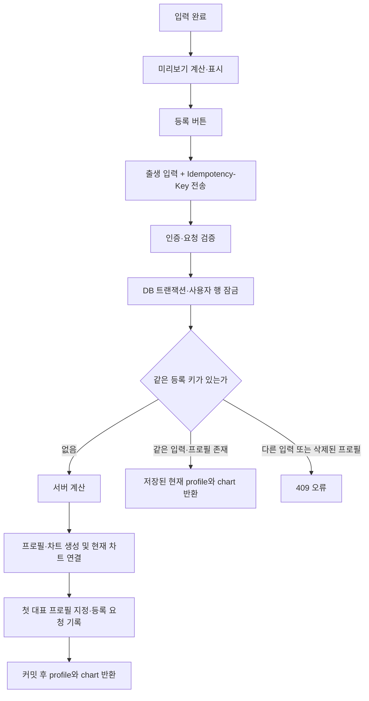

# 사주 프로필·만세력 저장과 CRUD

구현·개발 DB 검증: 2026-09-10.

## 저장 모델

미리보기는 저장하지 않는다. 프로필 등록 버튼을 누르면 서버가 출생 입력으로 계산하고
프로필과 만세력을 함께 저장한다. 조회 화면은 DB의 현재 Snapshot을 표시한다.

| 테이블 | 저장 내용 |
| --- | --- |
| `saju_profiles` | 소유자, 표시 이름·관계, 원본 달력·윤달·생년월일시·성별 기준, 현재 차트 ID |
| `saju_charts` | 정규화한 Snapshot JSONB, schema·엔진·정책 버전, 입력 해시, 계산 시각 |
| `saju_profile_creations` | 사용자별 등록 요청 키, 요청 해시, 생성한 프로필 참조. 재시도 중복 방지용 |

`saju_charts.payload`는 라이브러리 반환 객체가 아닌 `SajuChartSnapshotV1`이다.
한국시 보정 내역, 원국·십성·오행·공망·대운, quality·warnings를 보관한다.
대운은 UI에서만 제외한다. 오행·기둥마다 추가 테이블을 만들지 않는다.

등록 요청 기록에는 이름·생년월일·Snapshot 원문을 중복 저장하지 않는다.
프로필을 삭제하면 기록의 프로필 참조는 NULL이 되고, 요청 키·해시만 남겨 같은 요청으로
삭제한 프로필을 다시 만들지 않게 한다. 앱 사용자를 삭제하면 요청 기록도 cascade 삭제한다.

## API

기존 경로와 응답 형식을 유지한다. 성공·실패 envelope는 서버 OpenAPI 계약을 따른다.

| 메서드 / 경로 | 동작 |
| --- | --- |
| `POST /v1/saju-charts/preview` | 저장 없이 계산만 수행 |
| `POST /v1/saju-profiles` | 프로필과 최초 계산본 생성, `201 { profile, chart }` |
| `GET /v1/saju-profiles` | 현재 사용자의 프로필 요약 목록. Snapshot 본문 제외 |
| `GET /v1/saju-profiles/:profileId` | 프로필과 저장된 현재 계산본 조회. 재계산 없음 |
| `PATCH /v1/saju-profiles/:profileId` | 프로필 수정 및 필요한 경우 계산본 생성·활성화 |
| `DELETE /v1/saju-profiles/:profileId` | 프로필과 모든 계산 이력 hard delete |

모든 프로필 API는 인증·활성 가입 상태와 소유권을 검사한다. 타인 프로필은 404다.
프로필 응답은 오류를 포함해 `Cache-Control: no-store`다.
preview와 프로필 POST/PATCH는 기존 계산 제한기를 공유한다(프로세스별 IP당 60초 60회).

## 등록과 재시도



- Body는 `displayName`, `relationType`, `birth`다. 소유자 ID나 클라이언트 Snapshot은 받지 않는다.
- `Idempotency-Key`는 선택적 UUID 헤더다. 서버는 UUID를 소문자로 정규화한다.
- 같은 사용자·키·정규화 입력은 같은 프로필을 반환한다. 동시에 도착한 요청도 하나만 생성한다.
- 재시도 응답은 **기존 프로필과 현재 차트**다. 그 사이 수정한 이름·출생정보를 옛 값으로 되돌리지 않는다.
- 동일 키의 다른 입력은 `409 IDEMPOTENCY_KEY_REUSED`다.
- 삭제한 등록의 키는 `409 SAJU_PROFILE_CREATION_DELETED`다.
- 비정상적으로 현재 차트가 없는 기존 등록은 `409 SAJU_PROFILE_CHART_UNAVAILABLE`다.
- 기존 클라이언트 호환을 위해 키를 생략할 수 있다. 생략한 POST는 각각 별도 등록이다.
- 등록 폼은 한 화면에서 같은 입력을 재시도할 때 키를 재사용하고, 입력이 바뀌면 새 키를 만든다.
  키는 메모리에 보관하며 브라우저 새로고침이나 다른 기기의 새 등록까지 합치지 않는다.
- 미리보기는 트랜잭션이 없다. 저장은 사용자 잠금 후 로컬 계산하고, 모든 쓰기를 한 트랜잭션에서 수행한다.
  계산 또는 DB 작업 실패 시 프로필·차트·대표 지정·등록 키를 모두 rollback한다.

## 수정·삭제

| 요청 | 계산본 처리 |
| --- | --- |
| `birth` 없이 이름·관계만 수정 | 기존 계산본 유지, 재계산 없음 |
| 출생정보 변경 | 새 불변 계산본 생성 또는 동일 입력·기준의 기존 계산본 재사용 |
| 같은 출생정보, 다른 정책·엔진·시간대 자료 버전 | 현재 기준 계산본 생성 또는 재사용 |
| 같은 입력과 계산 기준 | 쓰기·재계산 없이 저장 결과 반환 |
| 원래 출생정보로 되돌림 | 원래 입력·기준의 계산본을 재사용 |
| 시간 알음 ↔ 모름 | 8글자 ↔ 6글자와 quality·warnings를 함께 저장 |

수정 폼은 `birth`도 제출하므로 옛 정책의 프로필을 저장하면 현재 정책의 계산본으로 갱신한다.
기존 Snapshot 본문은 수정하지 않는다. `(profile_id, input_hash)`가 계산본 중복을 막는다.

등록·수정·삭제는 사용자 행 잠금 후 소유권·현재 상태를 읽는다. 같은 사용자의 동시 요청이
서로 오래된 상태를 읽고 대표 프로필 또는 현재 차트를 엇갈리게 쓰지 않도록 직렬화한다.
다른 사용자의 작업은 같은 잠금을 공유하지 않는다.

프로필 삭제 시 현재 차트 참조를 분리하고 연결된 모든 차트를 cascade 삭제한다.
대표 프로필을 삭제하면 남은 프로필 중 `createdAt`, `id` 순으로 첫 프로필을 지정한다.
마지막 프로필을 삭제하면 대표 ID는 NULL이다. 삭제한 프로필의 재조회·수정·재삭제는 404다.

## DB 변경과 검증

`20260910190000_harden_saju_profile_storage` migration을 추가하고 개발 DB에 적용했다.

- exact 시간에는 시·분 모두 NOT NULL을 요구하도록 CHECK를 보완했다.
- 등록 요청 기록 테이블과 사용자·요청 키 복합 기본키를 추가했다.
- 저장 관련 세 테이블의 RLS와 PUBLIC/anon/authenticated 접근 제한을 migration으로 기록했다.
- Prisma schema 검증·클라이언트 생성을 확인했다. 기존 4개 migration은 수정하지 않았다.
- 서버 오류 로그에서 Prisma stack/query 인수를 제외해 출생정보가 로그에 남지 않도록 했다.

실제 PostgreSQL + Nest HTTP 통합 테스트 23개로 다음을 검증했다.

- 한국시 보정된 원국 저장과 재조회 JSON 일치, 조회 시 계산 없음
- 목록·이름·관계 수정, 입력 변경·되돌리기, 과거 정책 갱신, 시간 미상
- 동시 등록 재시도, 사용자별 키 분리, 키 충돌·삭제 후 재시도
- 동시 입력 수정·대표 프로필 삭제, 전체 계산 이력 삭제, 마지막 대표 해제
- 타인 접근 차단, 가입 상태·입력 검증, DB 시간 CHECK, RLS·클라이언트 역할 권한
- 마지막 등록 쓰기 실패의 전체 rollback, 수정 실패의 신규 차트 rollback

외부 인증 검증만 테스트용 principal로 대체하고 실제 HTTP 인증 guard·서비스·계산기·Prisma·PostgreSQL을 사용한다.
실패 주입은 테스트 프로세스의 Prisma query extension에서 해당 테스트 사용자/프로필에만 적용한다.
개발 DB에 오류 트리거나 테스트용 정책을 설치하지 않는다.

```bash
# 전용 테스트 DB: 임시 스키마에 모든 migration을 적용하고 종료 시 삭제
TEST_DATABASE_URL=... npm run test:integration

# 현재 개발 DB: migration이 이미 적용된 경우에만, 테스트용 UUID 두 개로 실행
npm run test:integration -- --development-db
```

두 번째 명령은 `.env`의 `NODE_ENV=development`를 확인한다. 이번 검증은 이 방식으로 실행했다.
새 스키마 생성 권한이 없어 임시 스키마 방식은 이번 환경에서 실행하지 못했다.
실행별 UUID 두 개의 사용자와 종속 데이터만 생성·정리한다. 전체 테이블 삭제는 하지 않는다.
테스트 사용자·프로필·차트·등록 요청 기록 정리를 확인했다.

## 배포와 후속 범위

- 다른 환경은 신규 migration 적용 후 서버, 그다음 클라이언트를 배포한다. 현재 개발 DB는 적용 완료다.
- runtime/migration 연결 변수는 구분돼 있으나 현재 설정은 동일한 pooler 주소다. 운영 역할·권한 분리는 후속 운영 설정이다.
- 테스트는 Supabase 실제 로그인 화면을 자동 조작하지 않는다. 프론트 저장 키 연결은 lint와 Next 빌드로 검증했다.
- 현재 저장된 만세력 조회는 프로필 상세 GET에서 제공한다. 과거 chartId 단독 조회·AI 풀이 저장은 다음 기능 범위다.
- 재물운 랭킹 참여자 추가의 데모 state를 실제 콘텐츠 저장으로 바꾸는 작업은 별도 범위다.
