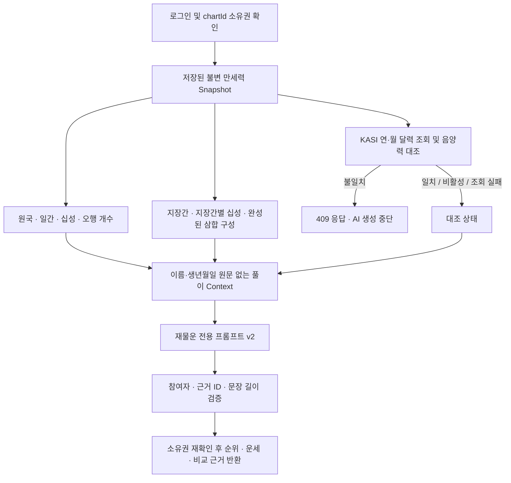

# 사주 풀이 데이터 조합과 적용 기준

검토·구현일: 2026-09-12. 현재 실제 AI 상품인 **무료 재물운 랭킹**에 적용했다.

## 권장 조합

**서버가 보관한 `manseryeok@2.0.0` 원국 + KASI 음양력 대조 상태 + 명시적으로 채택한 지장간·삼합 구성 + 상품별 AI 프롬프트**를 사용한다. 세 곳의 계산값을 평균하거나 여러 운세 문장을 합치는 방식은 사용하지 않는다.

이 조합은 계산 기준의 일관성, 출처 추적, 불필요한 외부 호출 감소를 우선한 설계다. 사주 해석의 과학적 정확도나 모든 유파에서의 최적성을 입증한 조합이라는 의미는 아니다.



## 세 자료의 역할

| 자료 | 확인한 성격 | 이번에 사용한 정보 | 실행 시 연결 방식 |
| --- | --- | --- | --- |
| [공공데이터포털 한국천문연구원 검색](https://www.data.go.kr/tcs/dss/selectDataSetList.do?sType=total&dType=API&keyword=%ED%95%9C%EA%B5%AD%EC%B2%9C%EB%AC%B8%EC%97%B0%EA%B5%AC%EC%9B%90) | 여러 천문 API의 검색 목록 | 실제 사용 서비스는 [한국천문연구원 음양력 정보, 15012679](https://www.data.go.kr/data/15012679/openapi.do)의 양력/음력 날짜와 윤달 구분 | 서버의 HTTPS API adapter, 인증키 필요 |
| [yhj1024/manseryeok](https://github.com/yhj1024/manseryeok) | 로컬 계산 라이브러리 | 기존 Snapshot의 원국·십성·일간·오행과 기존 달력/시간 정책, 새 지장간의 십성 계산 | 설치된 `2.0.0`을 그대로 사용, 별도 키 없음 |
| [hjsh200219/fortuneteller](https://github.com/hjsh200219/fortuneteller) | 계산·해석 기능을 가진 MCP 서버 소스 | 지장간에 포함되는 천간과 네 종류의 완전한 삼합 구성 기준을 참고 | 검토한 규칙을 Snapshot 위에서 독립적으로 구현, MCP 서버 실행이나 GitHub 키 불필요 |

GitHub 링크는 개인별 운세를 반환하는 공개 REST API 주소가 아니다. 매 요청마다 저장소를 내려받거나 원문을 프롬프트에 넣지 않는다. 출처·버전·채택 범위는 [saju-reading-sources.ts](../src/modules/readings/saju-reading-sources.ts)에 고정했다.

## 원국의 기준을 하나로 유지하는 이유

`manseryeok`는 입춘을 연주 경계, 절입을 월주 경계로 사용하고, 음양력 및 절입 자료를 포함한다. 이 서비스는 그 위에 **한국 역사적 민간시 처리, 기준 경도 127.5°, 균시차 제외, 보정된 시각의 자정 일 경계**를 적용하고 있다. 새 풀이도 저장 당시 `engineVersion`과 `policyVersion`을 따라야 한다. [라이브러리 README](https://github.com/yhj1024/manseryeok/blob/main/README.md), [서버 계산기](../src/modules/saju-profiles/saju-chart-calculator.ts)

`fortuneteller`의 별도 출생지/시간 보정과 자체 원국 계산을 다시 실행하면 기존에 사용자에게 보여준 차트와 다른 원국이 나올 수 있다. 검토한 리비전의 음력 처리에는 `convertCalendar` 호출에 `isLeapMonth`를 전달하지 않는 부분도 보인다. 따라서 그 엔진 전체를 두 번째 계산 기준으로 도입하지 않았다. [검토한 calculateSaju 소스](https://github.com/hjsh200219/fortuneteller/blob/1a930ad54c5342b855222e3aa304809b0ed587d5/src/lib/saju.ts#L47)

이번 변경은 Snapshot을 수정·재계산하거나 만세력 엔진을 교체하지 않는다. 지장간·삼합은 풀이 요청 시 생성하는 파생 정보이고, 풀이 정책 버전은 `saju-reading-evidence-v1`, 프롬프트 버전은 `wealth-ranking-v2`다.

## 추가하는 명리 정보와 해석 제한

기준 자료는 [fortuneteller의 지지 데이터](https://github.com/hjsh200219/fortuneteller/blob/1a930ad54c5342b855222e3aa304809b0ed587d5/src/data/earthly_branches.ts)다. 실행 코드를 복사하거나 외부 MCP를 등록하지 않고, 구성 관계만 서버에서 계산한다. 저장소 README·package metadata는 MIT를 표기하지만 검토 리비전의 루트 LICENSE 파일은 확인되지 않아 프로그램 전체를 재배포하는 방식도 선택하지 않았다.

| 프롬프트 필드 | 내용 | 적용 규칙 |
| --- | --- | --- |
| `facts` | 기존 6/8자의 위치·천간/지지·오행·음양·십성 | 비교의 기본 근거이며, 사람마다 최소 한 개의 ID를 인용해야 함 |
| `hiddenStemFacts` | 각 지지의 지장간, 일간 기준 십성, 본기 여부 | 시간 미상이면 시주 지장간 없음. 비율·세력 점수·중기/여기 가중치 없음 |
| `branchRelations` | 신자진·해묘미·인오술·사유축 중 세 지지가 모두 존재하는 구성 | 반합을 완성 삼합으로 취급하지 않음. 합화·오행 전환의 성립을 단정하지 않음 |
| `elementDistribution` | 기존 원국 6/8자 개수 | 지장간을 더하지 않음. 지지 본기와 지장간 본기를 별도 이득으로 중복 가산하지 않음 |
| `calendarVerification` | 공식 달력 대조 상태와 범위 | 순위 점수나 신뢰도 점수로 사용하지 않음 |
| `calculationPolicy`, `sources` | 계산·자료·풀이 정책 버전 | 출처 관리용. 외부 URL을 실행하거나 접근하라는 지시가 아님 |

재물 비교에서는 원국 위치와 정재·편재, 생산/표현에 해당하는 식신·상관, 관리/협업/학습에 관련한 십성을 먼저 읽고 지장간과 삼합 구성으로 맥락을 보완한다. 특정 십성의 개수만으로 순위를 정하지 않는다.

`fortuneteller`의 정량적 지장간 세력, 신강신약·격국·용신·신살 점수와 서술문은 가져오지 않았다. 이번에 채택하고 검증한 규칙의 범위를 넘기 때문이다. `judgments`와 `periodContext`는 계속 null이며 올해·현재 대운을 예측하지 않는다. 대운은 기존 Snapshot에 존재해도 이번 기간 없는 상대 랭킹의 근거로 추가하지 않는다.

추후 개인 종합·취업·전생 관계 상품을 구현할 때에도 출처와 사실 구성은 재사용할 수 있다. 다만 현재 다른 상품의 agent나 기간 계산을 미리 구현하지 않았다.

## KASI 연동 상세

사용 endpoint:

```text
GET https://apis.data.go.kr/B090041/openapi/service/LrsrCldInfoService/getLunCalInfo
```

공식 문서는 XML 응답과 `solYear`, `solMonth`, 선택 항목 `solDay`, 결과의 `lunYear`, `lunMonth`, `lunDay`, `lunLeapmonth` 등을 설명한다. [공식 API 상세](https://www.data.go.kr/data/15012679/openapi.do)

서버는 `ServiceKey`, `solYear`, `solMonth`, `numOfRows=31`, `pageNo=1`로 **공개 달력 한 달**을 가져온다. 이름·출생 일·시각·성별·계정 ID·차트 ID는 KASI에 보내지 않는다. 반환된 월의 날짜 수·중복·요청 월·응답 코드와 필드를 검증한 뒤, 서버 내부에서 해당 생일의 음력 날짜와 윤달 여부를 비교한다.

- `matched`: 양력 날짜와 대응 음력 날짜·윤달이 일치한다. 이것이 사주나 운세 전체의 정확도를 인증하지는 않는다.
- `disabled`: 기능이 비활성화되어 공식 실시간 대조를 하지 않았다.
- `unavailable`: timeout, 키/승인 오류, 잘못되거나 불완전한 XML 등으로 대조하지 못했다. 기본 원국으로 진행하되 상태를 프롬프트와 결과 `notice`에 표시한다.
- 검증된 달력과 저장 차트가 **불일치**하면 HTTP 409, `data.reason=SAJU_CALENDAR_MISMATCH`를 반환하고 AI 생성 전에 중단한다. 기존 Snapshot을 덮어쓰지 않는다.

동일 연·월의 진행 중 요청은 합치며, 완전히 검증한 월 자료만 프로세스 메모리에 24시간·최대 256개월 보관한다. 실패는 cache하지 않고 자동 재시도하지 않는다. 재물운의 기존 사용자별 호출 제한과 동시 실행 제한 안에서 동작한다.

HTTP 요청과 본문 수신에는 기본 2초(설정 범위 0.5~3초), 응답 64KiB 상한을 적용한다. 최대 5명의 요청을 병렬 처리하므로 KASI의 최대 추가 대기 시간은 약 3초다. 리다이렉트·DTD·외부 엔티티를 허용하지 않는다. XML 파싱에는 Node/기존 의존성에 없는 기능을 위해 `fast-xml-parser@5.11.1`을 추가했고, 파싱 후 Zod로 다시 검증한다.

### 음력 간지와 사주 원국을 혼동하지 않기

KASI의 `lunSecha`, `lunWolgeon`, `lunIljin`은 이번 대조 범위에 포함하지 않는다. 특히 음력 월건을 절입 기준 사주 월주로 치환해서는 안 된다. 민간 날짜와 한국 평균태양시 보정 후 날짜가 다를 수 있으므로 일진 역시 조건 없이 일주와 비교하지 않는다. 대조 대상은 `normalizedBirth.solarDate/lunarDate`이고 `correctedSolarDate`가 아니다.

검색 목록의 [특일 정보 API](https://www.data.go.kr/data/15012690/openapi.do)에도 24절기 조회가 있지만 이번 slice에는 추가 호출하지 않는다. 절입 경계는 기존 엔진에 포함된 자료와 서버 정책을 사용한다. 공휴일·기념일·일출몰은 이번 재물 성향 랭킹의 근거가 아니므로 입력에 추가하지 않는다.

## `.env` 설정

공공데이터포털에서 **한국천문연구원_음양력 정보(15012679)** 활용 신청 후 승인된 인증키를 서버 루트 `.env`에 입력한다. Encoding 키와 Decoding 키를 모두 받을 수 있도록 한 번만 디코딩한 뒤 요청 시 인코딩한다.

```dotenv
KASI_CALENDAR_VERIFICATION_ENABLED=true
KASI_SERVICE_KEY=
KASI_TIMEOUT_MS=2000
```

위 빈 `KASI_SERVICE_KEY`에 본인의 실제 키를 넣어야 활성화할 수 있다. 키 없이 `true`이면 시작 시 실패한다. 아직 키를 입력하지 않았다면 `KASI_CALENDAR_VERIFICATION_ENABLED=false`를 유지한다. `.env.example` 및 현재 `.env`에는 빈 입력란과 비활성 기본값을 추가했으며 기존 키는 보존했다.

환경변수를 수정한 뒤 서버를 재시작한다. GitHub 참고 자료나 `manseryeok`에는 API 키가 필요하지 않다. AI 키는 기존 `KIE_API_KEY`, 모델과 생성 옵션은 [ai-model.config.ts](../src/config/ai-model.config.ts)에서 계속 관리한다. 어떤 키도 프롬프트·응답·로그·프론트엔드에 넣지 않는다.

## API·데이터 호환성과 검증

기존 `POST /v1/readings/wealth-ranking`의 요청과 세 가지 출력 구조는 유지한다. 새 자료는 내부 Context에 추가했고, 공개 응답에서는 `promptVersion`과 `notice` 내용이 바뀐다. 409 오류 reason을 OpenAPI에 추가했다. 기존 프론트엔드가 `notice`와 서버 오류 메시지를 표시하므로 프론트엔드 수정이나 DB migration은 필요하지 않다.

검증 항목:

- 지장간별 십성, 시각 미상 시주 제외, 삼합의 세 구성원 조건, Snapshot 불변성
- 입력 순서/실명 배제, 새 근거 ID의 소유자·존재 여부, 원국 근거 최소 한 개
- KASI 키 인코딩, 월 cache·동시 요청 결합, 윤달, 잘못된 월/페이지/중복 날짜, timeout·오류 XML·DTD·크기 상한
- 소유권 확인 전 KASI 미호출, 공식 자료 불일치 시 AI 호출 차단, 조회 실패 시 명시적 안내

```bash
npm run lint
npm test
npm run test:e2e
npm run build
npm exec -- tsc --noEmit
```

외부 Provider 테스트는 network 없이 adapter를 대체한다. KASI XML 테스트 fixture는 합성 전송 자료이며 실제 공식 호출 성공 증거가 아니다. 현재 KASI 인증키가 없어 인증된 실제 대조는 아직 확인하지 못했다. 키 등록 후 실제 응답과 운영 이용 한도를 확인해야 한다. 이는 기존 manseryeok 경계 fixture 검증이나 AI 해석 품질 평가와 별개의 검증이다.

### 이번 실행 결과

- `npm run lint`, `npm run build`, `npm exec -- tsc --noEmit` 통과
- 단위 테스트 154개, E2E 76개 통과
- v2 프롬프트의 합성 참여자 2명 실제 Kie 호출은 기본 30초 및 진단용 60초 모두 시간 초과(504)로 끝나 실제 생성 결과는 확인하지 못함. 진단의 60초 값은 실행 중에만 적용했고 서버 `.env`의 기존 AI timeout은 변경하지 않음
- KASI는 인증키가 없어 실제 인증 호출을 미검증. `disabled` 상태를 유지하며 공식 대조 성공으로 표시하지 않음
- 신규 XML 파서 의존성의 `npm audit` 보고 항목은 없었고, 기존 dependency 트리의 high 9건은 이번 범위에서 자동 수정하지 않음
