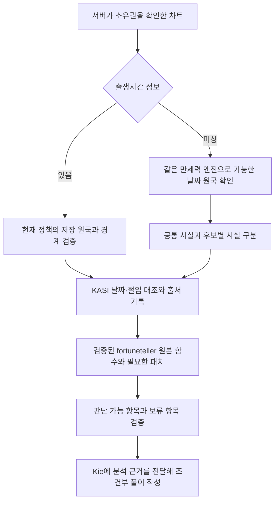

# 출생시간 미상과 fortuneteller 연결 검토

검토일: 2026-09-14. 이 문서는 당시 조사 결과와 제안이다. 후속 사용자 결정에 따라 원본 라이브러리 연결과 개인별 전체/부분 분석을 구현했다. 아래 후보 계산 제안은 적용하지 않았으며, 현재 동작은 [연결 문서](./fortuneteller-analysis.md)를 따른다.

## 권장 결론

정확성과 변경 위험을 함께 고려하면 **현재 만세력 엔진·한국시 정책을 유지하고, 시간 미상의 가능한 원국을 검증한 다음, 검증된 fortuneteller 원본 함수로 제한된 분석을 수행하는 방식**을 권장한다.

시간 있음/없음에 따라 서로 다른 달력 엔진을 사용하지 않는다. 시간 미상은 단일 원국으로 확정할 수 있는지 먼저 확인한다. 후보마다 달라지는 일간·십성·월령은 조건부 자료로 남기며, 전체 원국을 전제로 하는 강약·용신·재물 점수는 검증 전 보류한다. AI는 서버가 제공한 사실·규칙 결과의 범위를 넘어 계산하거나 누락된 값을 보충하지 않는다.

검증 가능한 정확성은 음양력·절입·시간대·원국 계산과 선택한 해석 규칙의 구현 일치성이다. 사주 해석의 실제 재물 예측 적중률은 API 연동이나 다른 프로그램과의 결과 일치만으로 입증되지 않는다.

## 조사 범위와 증거 수준

GitHub 문서뿐 아니라 아래 고정 리비전의 계산 함수와 관련 테스트를 읽었다. 외부 프로젝트의 전체 테스트 스위트는 실행하지 않았다. 현재 설치된 `manseryeok@2.0.0`과 서버의 실제 한국시 보정 함수로 합성 날짜 두 건을 분 단위 전수 확인했고, fortuneteller의 순수 강약 함수에 합성 중간값을 넣어 분기를 확인했다. 실제 사용자 프로필·DB·인증키·KASI/Kie 실호출은 사용하지 않았다.

| 프로젝트                                                                                                                                  | 검토 리비전 | 관찰한 구현과 적용 판단                                                                                                                                                                                    |
| ----------------------------------------------------------------------------------------------------------------------------------------- | ----------- | ---------------------------------------------------------------------------------------------------------------------------------------------------------------------------------------------------------- |
| [oh-my-saju](https://github.com/JaeSang1998/oh-my-saju/tree/a8c0cf64adfde8fb1ce253112529edd8e90cc94b)                                     | `a8c0cf64`  | 절기·시간대·보정시각 경계를 따라 구간을 나누고 후보와 공통 기둥을 반환한다. 후보를 관리하는 구조를 참고하기 좋다. 전체 엔진을 교체할 근거로 삼지는 않는다.                                                 |
| [dsh-fate-spectrum](https://github.com/EchoUser005/dsh-fate-spectrum/tree/b5adfca0fedf27a9ee7ce53cb4d07b634b43b05b)                       | `b5adfca0`  | 하루 1,440분을 계산하고 같은 분석 사실을 가진 후보를 묶는다. 구현과 검증 기준이 명확하다. 해당 문서는 진태양시 적용 후 재검증 필요를 명시하므로 한국시 정책까지 검증됐다고 볼 수 없다.                     |
| [bazi-flex-mcp](https://github.com/ronload/bazi-flex-mcp/tree/4bac6caa4d3703cfffc2f639c6ece7203b9c37c2)                                   | `4bac6caa`  | 현재는 직접 3주를 계산한다. 절기 당일은 새 년·월주를 대표값으로 사용하면서 전후 후보를 표시한다. 이 날짜 단위 대표값 정책을 우리 정책으로 그대로 가져오지는 않는다.                                        |
| [bazi-engine](https://github.com/David88666/bazi-engine/tree/ee8fac7c336ff7ba471fde6f4c5e8bfa0e86e141)                                    | `ee8fac7c`  | 시간이 없으면 시주의 stem/branch가 null이다. 절기 판단에는 UTC 정오를 내부 기준으로 사용하며 강약·용신 후보도 계산한다. 시주가 비어 있다는 사실만으로 나머지 계산이 시간 가정에서 독립적이라고 볼 수 없다. |
| [four-pillars-claude-skill](https://github.com/ruthless-coder-ai/four-pillars-claude-skill/tree/95905ae676c3d2171806d0f4c147c10c8f6ca04a) | `95905ae6`  | 임시 정오로 기반 엔진을 호출한 뒤 출력 기둥에서 시주를 빼고 오행을 다시 센다. 성별이 있으면 같은 내부 계산 객체로 대운도 생성하므로 전체 출력의 시간 의존성까지 제거한 구현은 아니다.                      |

이들은 확인한 공개 구현 사례다. 어느 프로젝트도 이번 조사만으로 가장 정확한 엔진이나 업계 표준이라고 평가하지 않는다.

### 후보를 구분하는 실제 코드

- **oh-my-saju:** `calculateSajuPossibilities`가 시간 미상에서 시주를 제외한다. 절기·IANA 전환·태양시 경계를 구간에 반영하고 `stablePillars`, `candidates`, `unresolvableWindows`를 반환한다. 구간 안에서 결과가 달라지면 무결성 오류로 처리한다. [계산 함수](https://github.com/JaeSang1998/oh-my-saju/blob/a8c0cf64adfde8fb1ce253112529edd8e90cc94b/src/auditable/calculate-saju-possibilities.ts#L847)
- 입춘일의 년·월주 후보, 한국 과거 표준시/DST의 gap·fold, 태양시 보정의 자정 통과 테스트가 있다. 테스트에서 선택한 시계·환일 정책은 우리 서비스 정책과 별도로 확인해야 한다. [경계 테스트](https://github.com/JaeSang1998/oh-my-saju/blob/a8c0cf64adfde8fb1ce253112529edd8e90cc94b/src/auditable/calculate-saju-possibilities.test.ts#L381)
- 해석 쪽 테스트는 부분 집계에 `coverage: partial`과 제외 기둥을 표시하고, 후보별로 바뀌는 해석을 `candidate-dependent`로 다룬다. [부분 해석 테스트](https://github.com/JaeSang1998/oh-my-saju/blob/a8c0cf64adfde8fb1ce253112529edd8e90cc94b/plugins/oh-my-saju/runtime/traditions/possibilities.test.ts)
- **dsh-fate-spectrum:** `calculateUnknownChart`는 00:00부터 23:59까지 열거하고, 원국·일간·운의 관련 사실로 후보를 묶으며 적용 시간 범위를 남긴다. 미상 후보에는 시주를 넣지 않는다. [계산 함수](https://github.com/EchoUser005/dsh-fate-spectrum/blob/b5adfca0fedf27a9ee7ce53cb4d07b634b43b05b/src/providers/bazi/tyme-bazi.provider.ts#L128), [채택 이유와 한계](https://github.com/EchoUser005/dsh-fate-spectrum/blob/b5adfca0fedf27a9ee7ce53cb4d07b634b43b05b/docs/project/decisions/0013-unknown-birth-time-candidates.md)

### 임시 정오와 null의 의미

- bazi-flex는 과거 임시 정오에서 시주를 제거했지만 현재는 직접 3주 계산으로 변경했다. 다만 대운의 시작 계산에는 날짜 내 월령 구간의 중간 시점을 사용한다. [현재 코드](https://github.com/ronload/bazi-flex-mcp/blob/4bac6caa4d3703cfffc2f639c6ece7203b9c37c2/packages/core/src/calendar/chart.ts#L184), [변경 검증 테스트](https://github.com/ronload/bazi-flex-mcp/blob/4bac6caa4d3703cfffc2f639c6ece7203b9c37c2/packages/core/test/threePillars.test.ts#L1)
- bazi-engine의 `hour`는 객체 전체가 null이 아니라 `{stem: null, branch: null, label: ...}`다. 출생시각이 없을 때의 `birthUtcMs`는 `Date.UTC(..., 12, 0, 0)`이며 절기와 대운 계산에 사용된다. [시간 미상 경로](https://github.com/David88666/bazi-engine/blob/ee8fac7c336ff7ba471fde6f4c5e8bfa0e86e141/src/calculate.ts#L1070)
- four-pillars의 오행 집계는 실제 출력 기둥만 순회하므로 시주가 빠진다. 그러나 대운은 시간 미상 여부와 무관하게 성별이 있으면 생성한다. [출력·대운 코드](https://github.com/ruthless-coder-ai/four-pillars-claude-skill/blob/95905ae676c3d2171806d0f4c147c10c8f6ca04a/scripts/chart.py#L237)

## 현재 프로젝트에서 직접 재현한 사항

현재 설정:

- `manseryeok@2.0.0`, `policyVersion: kr-mean-solar-midnight-v2`.
- 기본 `Asia/Seoul`, 127.5도 기준 한국 평균태양시, 균시차 제외.
- 당시 민간시 UTC 오프셋은 서버에서 해석하고 라이브러리에 전달한다. 중복 DST 보정은 끈다.
- 보정 시각의 자정에 일주가 바뀐다.

현재 시간 미상 Snapshot은 날짜를 대표하는 정오를 내부 계산에 사용하고 시주를 제거한다. 오행은 6자로 다시 세고 대운을 제공하지 않는다. 절기 경계일의 시간 미상 등록은 제한하며, 일 경계 불확실성 경고를 남긴다. 이 보호 장치는 유지할 가치가 있지만, 날짜를 대표하는 일주를 실제 일간의 확정값으로 AI에 전달하면 경고만으로는 부족하다.

관련 파일: [계산기](../src/modules/saju-profiles/saju-chart-calculator.ts), [한국시 해석](../src/modules/saju-profiles/korean-birth-time.ts), [기존 시간 미상 테스트](../src/modules/saju-profiles/saju-chart-calculator.spec.ts), [기존 풀이 프롬프트](../src/modules/readings/infrastructure/wealth-ranking.prompt.ts).

### 합성 날짜 분 단위 전수 확인

`resolveKoreanBirthTime`의 실제 소스와 설치된 `calculateFourPillars`를 사용했다. 각 날짜의 00:00~23:59, 총 1,440개의 분 시작 시각을 계산하고 년·월·일주가 같은 연속 구간을 묶었다. 각 날짜의 검사 범위 합계가 1,440분임을 확인했다.

| 합성 양력 날짜 | 검사한 한국 민간시 구간 | 년주 / 월주 / 일주 |
| -------------- | ----------------------- | ------------------ |
| 1994-05-22     | 00:00~00:29             | 갑술 / 기사 / 정미 |
| 1994-05-22     | 00:30~23:59             | 갑술 / 기사 / 무신 |
| 2024-02-04     | 00:00~00:29             | 계묘 / 을축 / 정유 |
| 2024-02-04     | 00:30~17:26             | 계묘 / 을축 / 무술 |
| 2024-02-04     | 17:27~23:59             | 갑진 / 병인 / 무술 |

이는 현재 정책에 따른 엔진 출력 재현이다. 표의 구간은 분 시작 시각을 검사한 결과이며 초 단위 절입 시각을 독립 검증한 자료가 아니다. KASI 실호출이나 외부 엔진 비교는 이 실험에 포함하지 않았다. 실행 시간은 이 환경의 두 날짜에서 각각 약 20ms, 14ms였으며 운영 성능 보장은 아니다.

일반 날짜도 한국시 보정 때문에 일주가 둘일 수 있다. 따라서 시주만 지우면 년·월·일이 모두 확정된다는 전제는 현재 정책에서 성립하지 않는다. 일간이 달라지면 같은 다른 천간의 십성도 달라지므로 이 불확실성은 재물 분석에 직접 전파된다.

## fortuneteller를 직접 사용하기 전에 필요한 검증

검토 원본: `hjsh200219/fortuneteller@1a930ad54c5342b855222e3aa304809b0ed587d5`.

| 확인 사항                                                   | 영향                                              | 권장 처리                                                                      |
| ----------------------------------------------------------- | ------------------------------------------------- | ------------------------------------------------------------------------------ |
| 십성 분포가 지장간 세력보다 먼저 계산됨                     | 원본 전체 호출에서는 기본 지지 가중치 경로를 사용 | 연결 코드에서 지장간 후 십성 분포 순서를 명시하고 원본 전체 결과와 차이를 기록 |
| 일간과 같은 천간을 다른 위치에서도 제외                     | 다른 기둥·지장간의 비견이 누락됨                  | 일간 위치만 제외하도록 검증된 패치를 관리                                      |
| 지장간 함수의 입력 월 번호와 내부 지지 배열의 시작점이 다름 | 계절 가중치가 의도한 월과 어긋날 수 있음          | 번호 기준을 명시하고 12개월 대응 테스트                                        |
| 가중치 분포를 받는 강약 함수에서 `=== 1` 분기 사용          | 1~2 사이의 값이 잘못된 기본 분기로 들어갈 수 있음 | 가중치 단위와 임계값을 검토한 뒤 채택; 임의로 새 임계값을 정답으로 만들지 않음 |
| 일반 격국이 가장 많은 십성에 의해 선택됨                    | 월령·투출 등을 종합한 판정으로 오해할 수 있음     | 구현한 판정 방법을 표시하고 검증 전 확정 격국으로 사용하지 않음                |
| 재물 점수가 재성 오행 개수와 오행 균형 위주                 | 시간 미상·정보량 차이와 복합 해석을 반영하지 못함 | 최종 재물 랭킹의 직접 정렬 점수로 사용하지 않음                                |

근거: [원본 계산 순서](https://github.com/hjsh200219/fortuneteller/blob/1a930ad54c5342b855222e3aa304809b0ed587d5/src/lib/saju.ts#L120), [십성 분포](https://github.com/hjsh200219/fortuneteller/blob/1a930ad54c5342b855222e3aa304809b0ed587d5/src/lib/ten_gods.ts#L143), [지장간 가중치](https://github.com/hjsh200219/fortuneteller/blob/1a930ad54c5342b855222e3aa304809b0ed587d5/src/data/earthly_branches.ts#L359), [강약 함수](https://github.com/hjsh200219/fortuneteller/blob/1a930ad54c5342b855222e3aa304809b0ed587d5/src/lib/day_master_strength.ts#L17), [격국 함수](https://github.com/hjsh200219/fortuneteller/blob/1a930ad54c5342b855222e3aa304809b0ed587d5/src/lib/gyeok_guk.ts#L328), [재물 함수](https://github.com/hjsh200219/fortuneteller/blob/1a930ad54c5342b855222e3aa304809b0ed587d5/src/lib/fortune.ts#L308).

강약 함수 분기만 실제 실행한 합성 실험에서는 월령 입력을 `medium`, 다른 십성 가중치를 0으로 고정했다. 겁재 가중치만 1 / 1.5 / 2로 바꾸면 점수가 75 / 60 / 85가 나왔다. 1.5 입력에서 비겁이 없다는 설명이 반환됐다. 이 실험은 함수의 분기 동작을 확인한 것이며 완전한 실존 원국이나 해석의 정답을 검증한 사례는 아니다.

따라서 직접 연결과 분석 정확도 검증은 각각 필요하다. 기존 서버 자체 참고 분석이 원본보다 정확하다는 뜻도 아니다. 양쪽 모두 이름·숫자를 붙였다는 이유만으로 검증된 해석이 되지는 않는다.

## 제안하는 연결 구조

### 원국과 후보

1. 정확한 시간이 있는 기존 차트는 연결 시 fortuneteller의 생년월일 재계산 함수를 호출하지 않는다.
2. 시간 미상은 같은 엔진·정책으로 해당 민간 날짜의 가능한 결과를 조사한다. 이 계산은 만세력 계층의 후보 검증이며 다른 라이브러리로 원국을 다시 정하는 절차가 아니다.
3. 초 단위 절입, 보정 자정, IANA 전환을 경계로 처리한다. 분 단위 전수 계산은 초기 비교 기준으로 유용하지만 분 내부 경계를 없다고 간주하지 않는다. 엔진·공식 자료의 정밀도가 부족하면 그 구간은 불확실 상태로 남긴다.
4. 날짜 전체를 누락 없이 검사했음을 검증한다. DST gap은 존재하지 않는 시간으로 구분하고 fold는 두 실제 순간을 보존해야 한다. 현재 해석기가 거부하는 역사적 구간은 지원을 검증하기 전까지 명시적으로 보류한다.
5. 후보는 년·월·일의 실제 조합으로 보존한다. 각 기둥의 후보를 따로 섞어 성립하지 않는 원국을 만들지 않는다. 시간 완전 미상에서는 전달할 후보의 시주는 null이다.
6. 긴 시간 구간의 후보를 실제 출생시각의 확률이 높다는 이유로 선택하지 않는다. 후보 개수·기간 비율은 출생 확률이 아니다.

### 원본 분석과 AI

1. 원본 `calculateTenGod`, `extractJiJangGan`, 검토한 월령·지지 관계 함수를 후보별로 사용할 수 있다. 필요한 입력이 안정적인지부터 확인한다.
2. 시주를 직접 참조하는 집계는 존재하는 기둥만 순회하도록 최소 패치를 한다. 가짜 시주를 넣거나 `null`을 숫자 0으로 대체하지 않는다.
3. 지장간 구성과 지장간 세력은 구분한다. 세력·신강약·격국·용신처럼 선택한 해석법의 영향이 큰 항목은 방법·버전·근거를 붙이고 검증되지 않은 결과는 보류한다.
4. 후보 모두에서 동일한 분석 사실은 공통 사실로, 달라지는 것은 후보 ID와 조건으로 전달한다. 부분 범위에서 관찰되지 않은 십성을 원국 전체의 부재로 쓰지 않는다.
5. 단순 `status: partial`만으로 끝내지 않고 각 판단의 필요 기둥, 관찰 범위, 후보 의존성, 보류 사유를 서버에서 결정한다. AI가 이러한 상태를 결정하거나 누락 값을 보충하게 하지 않는다.
6. 공식 대조 성공은 그 날짜·절입 범위의 대조 성공만 뜻한다. 분석 규칙이나 재물운이 공식 인증됐다는 표현은 금지한다.
7. KASI 조회는 날짜·연도 단위로 재사용하고, 모든 후보에 대해 외부 API를 반복 호출하지 않는다. 후보를 정리한 뒤 Kie를 한 번 호출한다.

### 재물 랭킹 정책

앞서 제안한 전원 3주 비교는 정보량 차이를 줄이는 방법이지만, 일간·월주가 불확실한 문제나 사주 해석의 타당성을 해결하지는 않는다.

정확성 우선 정책은 다음과 같다.

- 같은 범위와 같은 해석 방법으로 비교한다. 시간 미상이라는 이유 자체로 감점하지 않는다.
- 후보에 따라 달라지는 재성·월령·강약을 단일 확정 근거로 순위에 사용하지 않는다.
- 공통 근거만으로 차이를 설명할 수 없으면 판단 보류 또는 동등한 성향으로 표시한다. 근거가 같은데 표시 순서만 달라진 경우 우열이 생긴 것처럼 설명하지 않는다.
- 서비스상 항상 1~n 순서가 필요하다면 이를 잠정적인 콘텐츠 순서로 명시해야 한다. 정확한 우열이라고 주장할 수 있는 계약은 아니다.
- LLM이 순위를 선택하는 현재 구조는 재현 가능한 계산 순위가 아니다. 반복 결과의 안정성이 중요하면 먼저 검토된 비교 규칙과 동률 정책을 서버에서 정하고, AI는 정해진 비교 근거를 문장화하도록 범위를 좁혀야 한다. 임의 가중치로 새 재물 점수를 만들지는 않는다.

### 변경 위험을 줄이는 적용 순서

1. 기존 정책을 유지하고 합성 경계 사례를 먼저 고정한다. 이번에 확인한 일반 날짜의 두 일주, 입춘일, 윤달, 역사 표준시/DST, 시간 미상으로 전환한 경우를 포함한다.
2. 원본 함수의 입력 변환·월 인덱스·십성 집계·가중치 분기를 검증하고, 통과한 분석 항목만 사용한다. 문제 있는 종합 판단은 연결 성공 여부와 무관하게 보류한다.
3. 새 후보 검증 결과를 기존 Snapshot과 별도로 버전 관리한다. 기존 불변 Snapshot을 덮어쓰지 않는다. 원국 후보의 공개 응답이 필요하면 기존 계약에 대한 확장·마이그레이션을 함께 설계한다.
4. 후보 도출은 기존 백그라운드 작업의 준비 단계에서 처리한다. 그 뒤 KASI 대조, 서버 분석, AI 풀이, 저장 순서를 유지한다.
5. 기존과 새 분석을 합성 사례로 비교하고, 해석법에 대한 검토 기준을 확보한 뒤 적용한다. 같은 원본 함수 출력과 같다는 검증은 구현 일치성 검증이며 해석의 정답 검증을 대신하지 않는다.

## 이번 작업 상태

- 추가 파일: 이 조사 문서 한 개.
- 서비스 코드·설정·의존성·DB·공개 API·Frontend 변경 없음.
- 현재 엔진/한국시 소스의 합성 날짜 2건 × 1,440분 검사 완료. fortuneteller 강약 함수의 합성 가중치 3개 분기 실행 완료.
- 외부 라이브러리 설치, 전체 외부 테스트 실행, 실사용자 풀이 생성 없음.
- 문서만 추가했으므로 서비스 lint·전체 unit/e2e·build는 재실행하지 않는다. 구현 단계에서는 위 회귀 사례와 기존 품질 검사를 수행해야 한다.
