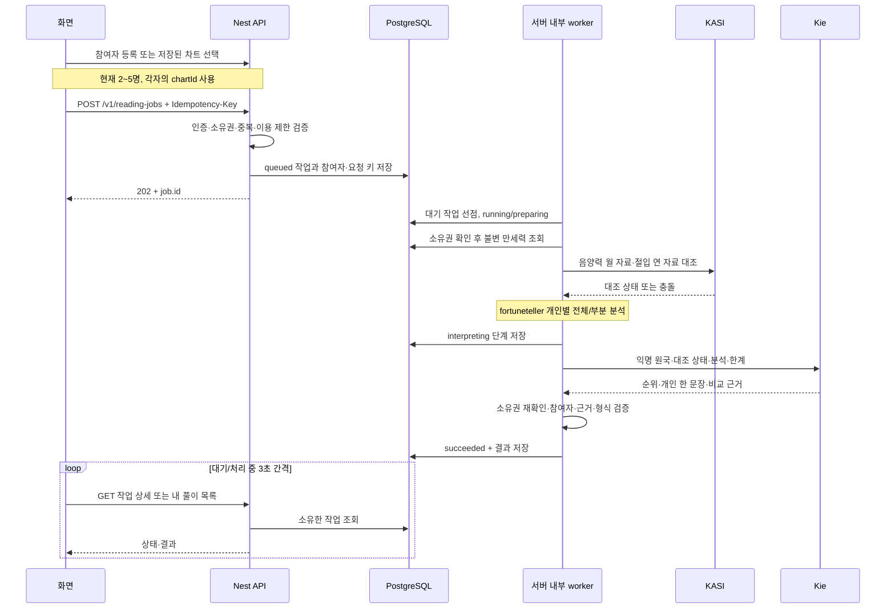

# 재물운 랭킹 현재 동작 흐름 점검

> 이 문서는 점검 당시 기록이다. 이후 반영한 공개 결과 조회·재방문 진행 UI·다시 해보기 제거의 현재 계약은 [reading-jobs.md](./reading-jobs.md)를 따른다.

점검일: 2026-09-14. Backend와 Frontend 호출 경계, 로컬 설정, 실행된 API, DB 준비 상태를 확인했다. 이번 점검은 코드 변경 없이 수행했으며 아래 재접수 보완점은 아직 수정하지 않았다.

## 결론과 확인 범위

현재 화면은 저장형 백그라운드 API를 사용한다. 저장된 만세력 → KASI 대조 완료 → 설치된 fortuneteller 개인별 분석 → Kie → 검증·저장 순서가 연결되어 있다. 시간 미상자만 부분 분석을 받고, 시간이 있는 다른 참여자의 분석은 유지된다.

점검 시작 때는 3000 Frontend만 실행되어 있었으나, 최종 확인 때는 8080 Backend도 실행 중이었다. `/health`, `/openapi.json` 모두 HTTP 200이며 실제 OpenAPI에 작업 생성 202·목록·상세 경로와 설치된 원본 분석 설명이 존재한다. 최초 미실행 상태가 최종 상태를 의미하지 않는다.

실제 사용자 풀이·Kie 유료 호출은 실행하지 않았다. Provider 호출 순서와 요청 body는 대체 응답을 사용하는 테스트로 확인했다. DB는 읽기 전용으로 작업 테이블과 migration 적용을 확인했다. 격리된 DB 통합 테스트는 임시 schema 생성 단계에서 PostgreSQL `42501` 권한 오류가 발생해 실행하지 못했다. 테스트 schema와 사용자 데이터는 생성되지 않았다.

## 화면부터 결과까지

1. 신규 참여자는 프로필 저장 시 서버에서 만세력을 계산하고 불변 Snapshot을 만든다. 재물운 요청에서는 이미 저장된 차트를 조회한다.
2. Frontend는 `createReadingJob`으로 `productCode: wealth-ranking`, `chartIds`와 UUID 요청 키를 보낸다. 접수 응답을 받으면 `/readings/jobs/{jobId}`로 이동한다.
3. Backend는 실제 차트 소유권과 서로 다른 프로필 여부를 검증한다. 계정당 대기/실행 작업 하나, 신규 접수 분당 3회 제한이다. 동일 키·동일 본문의 재접수는 기존 작업을 반환한다.
4. Nest 내부 worker가 2초 간격으로 대기 작업을 확인한다. 인스턴스당 동시 2개이며 DB 조건부 갱신으로 한 작업을 선점한다. 60초 lease를 10초마다 갱신한다.
5. KASI 음양력·특일 대조는 병렬 진행한다. 모든 대조 결과가 준비되어야 개인 분석과 Kie 호출로 넘어간다.
6. 실제 설치한 `@hoshin/saju-mcp-server@1.2.0-sunnyeo.1` 분석 함수를 서버 안에서 실행한다. 별도 fortuneteller HTTP API를 호출하는 구조는 아니다.
7. Kie에는 `p1`, `p2` 같은 익명 참여자의 원국 사실·지장간·분포·분석 범위·KASI 상태를 전달한다. 이름·생년월일시 원문·chartId·인증키를 풀이 입력에 넣지 않는다. Kie가 근거를 비교해 최종 순위와 한국어 문장을 작성한다.
8. 출력은 참여자 누락/중복, 근거 ID, 순위, 한 문장과 한 단락 형식을 검증한다. 성공 결과를 DB에 저장하고 이후 GET은 저장된 결과만 읽는다.

기존 `POST /v1/readings/wealth-ranking` 동기 경로는 deprecated 상태로 남아 있다. 현재 시작 화면은 새 작업 API를 사용한다. 현재 작업 계약에서 구현된 상품은 재물운 랭킹 하나다.

근거: [Frontend 접수](../../saju-platform/src/domains/wealth_ranking/model/use_wealth_ranking.ts), [작업 API](../src/modules/readings/reading-jobs.controller.ts), [접수·조회 service](../src/modules/readings/reading-jobs.service.ts), [worker](../src/modules/readings/reading-jobs.worker.ts), [실제 분석 순서](../src/modules/readings/wealth-ranking.service.ts).

## 시간 입력 여부와 자료의 역할

| 단계 | 시간 입력자 | 시간 미상자 |
| --- | --- | --- |
| 원국 | 기존 4주 | 기존 3주, 시주 null |
| 지장간·가중 십성·월령·관계 | 4주 범위 | 확인된 3주 범위 |
| 강약·격국·용신·신살 | 실행 | 호출 제외, null |
| 재물 분석 | 원본 함수 실행 | 부분 입력으로 원본 함수 실행 |
| 원본 재물 점수 | 참고값, 정렬 키 아님 | 전달하지 않음 |
| AI·사용자 안내 | 해당 기둥과 분석 사용 | 누락 범위와 해석·순위 변동 가능성 표시 |

9명 전체 + 1명 부분이라는 내부 조합 테스트도 통과했다. 공개 API 제한은 여전히 최대 5명이다. 시간 미상 경계의 일주 불확실성은 기존 warning과 조건부 해석으로 전달하고, 가능한 모든 시간대 원국을 열거하지는 않는다.

KASI는 음양력·윤달 및 절입에 따른 연주·월주 대조 자료다. 날짜·원국이 불일치하거나 절입 경계가 불확실하면 AI 전에 중단한다. 조회 실패·미제공·비활성은 대조 성공으로 처리하지 않고 상태와 notice에 표시한 뒤 기존 만세력으로 풀이를 진행할 수 있다. 따라서 모든 성공 결과가 KASI 대조 성공을 의미하지는 않는다.

검증된 KASI 월/연 자료는 24시간 메모리에 캐시한다. 캐시가 있으면 외부 HTTP 호출 없이 대조가 끝나 Kie 호출이 빠르게 시작할 수 있다. 만세력 조회와 fortuneteller는 서버 내부 처리이므로 브라우저 Network에 별도 요청으로 나타나지 않는다.

근거: [KASI 음양력](../src/modules/readings/infrastructure/kasi-calendar.provider.ts), [KASI 특일](../src/modules/readings/infrastructure/kasi-solar-terms.provider.ts), [fortuneteller adapter](../src/modules/readings/infrastructure/fortuneteller-analysis.adapter.ts), [AI 프롬프트](../src/modules/readings/infrastructure/wealth-ranking.prompt.ts), [출력 검증](../src/modules/readings/wealth-ranking-result.ts).

## 화면 이탈·새로고침·장애

- 접수된 작업은 브라우저의 요청 연결과 독립적으로 처리된다. 화면 이탈은 브라우저 요청만 취소한다.
- 상세·내 풀이 목록은 대기/실행 상태에서 3초 간격으로 조회하고, 다시 방문하거나 브라우저에 복귀하면 상태를 다시 읽는다.
- 로딩은 상태 카드에 표시하며 다른 화면으로 이동할 수 있다. 완료 시 저장된 결과, 실패 시 안전한 오류와 새 요청 링크를 표시한다.
- 조회 실패만으로 새 AI 요청을 보내지 않는다. `다시 확인`은 GET 재조회다.
- 서버 프로세스 자체가 종료되면 처리가 중단된다. worker가 다시 실행될 때 만료된 준비 작업은 재접수하고, AI 시작 이후 결과가 불명확한 작업은 `READING_INTERRUPTED`로 종료한다. AI를 자동 중복 호출하지 않는다.
- 푸시 알림·전역 토스트가 아니라 상세/내 풀이 목록을 다시 조회하여 완료를 확인하는 방식이다.

근거: [상세 polling과 UI](../../saju-platform/src/domains/reading_job/ui/reading_job_page.tsx), [내 풀이 목록](../../saju-platform/src/widgets/reading_jobs/ui/reading_jobs_list.tsx), [worker 복구](../src/modules/readings/reading-jobs.worker.ts).

## 확인된 보완점: 참여자 재선택 순서와 요청 키

접수 응답을 놓친 뒤 재접수할 때 참여자 선택 **순서**가 달라지면 새 요청으로 처리될 수 있다. Frontend `use_wealth_ranking.ts` 206~229줄은 선택한 순서 그대로의 `chartIds`를 JSON 문자열로 만들어 저장된 요청 서명과 비교한다. A→B와 B→A는 다른 서명이므로 새 요청 키를 발급한다.

이때 이전 작업이 아직 진행 중이면 서버의 409 제한이 막아준다. 그러나 이전 작업이 이미 완료된 상태라면 새 키로 새 작업이 생성되어 의도하지 않은 AI 재생성이 발생할 수 있다. 이는 코드 분기와 현재 계약으로 확인한 조건이며 이번 점검에서 실제 유료 중복 요청을 실행하지 않았다.

권장 후속 수정: 참여자 집합을 기준으로 정규화한 요청 서명과 전송 순서를 사용하고, 이미 sessionStorage에 남은 이전 서명·요청 키와의 재조회 호환성을 함께 처리한다. 현재 Backend 계약은 같은 키의 본문 변경을 거절하므로 키만 재사용하면서 전송 순서를 바꾸면 안 된다. 이번 점검에서는 Frontend·API 코드를 변경하지 않았다.

## 설정·DB·테스트 확인

실제 인증키 값을 출력하지 않고 존재 여부와 활성 flag만 확인했다.

| 확인 항목 | 결과 |
| --- | --- |
| Frontend API 주소 | localhost:8080 |
| 최종 Backend health/OpenAPI | HTTP 200 |
| 재물운·worker·음양력·특일 활성 flag | 모두 true |
| Kie·음양력·특일 키 | 모두 등록됨, 유효성 실호출은 이번 점검에 미포함 |
| AI 시간 제한 | 현재 300000ms = 5분, 설정 허용 최대 10분 |
| KASI 시간 제한 | 2000ms |
| DB 작업·참여자·요청 키 테이블 | 존재 |
| 작업 migration | 적용 완료 |
| DB 읽기 확인 시 대기/실행/만료 작업 | 각각 0개 |
| 서버 관련 단위 테스트 | 113개 통과 |
| HTTP E2E | 86개 통과 |
| Frontend 상태·결과 mapper | 25개 통과 |
| 실제 PostgreSQL 통합 테스트 | 임시 schema 생성 권한 오류 42501로 미실행 |

이번 변경 파일은 이 점검 문서 하나다. 앞선 구현 이후 소스 변경이 없으므로 lint·build는 이번에 반복하지 않았다. 실제 로그인 화면에서 유료 모델 호출까지 완료한 검증과는 구분해야 한다.
