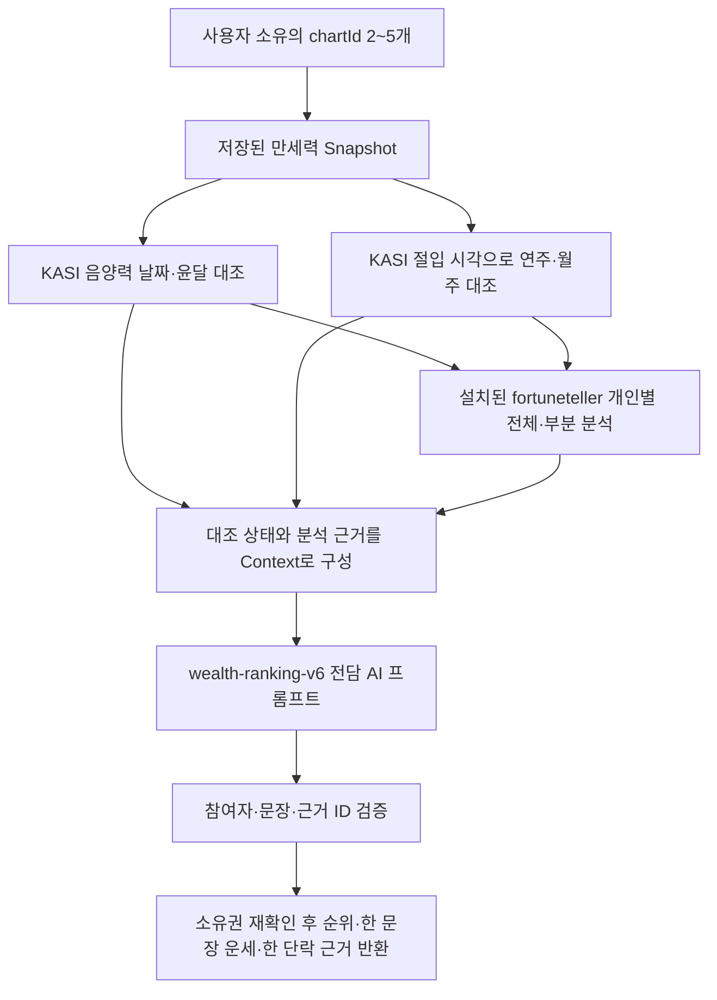

# 재물운 랭킹의 공식 자료 대조와 AI 분석

> 포츈텔러를 포함한 최신 전처리·분석과 단계별 로그는 [세 자료 조합 문서](./fortuneteller-analysis.md)를 참고한다.

재물운 랭킹은 소유권을 확인한 만세력 Snapshot을 바탕으로 음양력·윤달과 연주·월주 경계를 KASI 자료와 대조하고, 서버가 분류한 재물 성향의 근거를 전담 AI 프롬프트에 전달한다. 날짜와 간지의 대조 정확도와 운세 해석은 구별한다. 공공 API는 미래 수익이나 운세의 정확도를 인증하지 않는다.

## 처리 흐름



음양력·절기 요청은 병렬 수행하고 같은 월·연도 요청은 합친다. KASI에는 공개 달력의 연·월만 전달한다. AI에는 이름, 생일·시각 원문, chartId, 사용자 ID, 인증키, API 응답 원문을 전달하지 않는다. 외부 응답으로 기존 Snapshot을 덮어쓰지 않는다.

## 설정

서버 루트 `.env`에서 두 인증키를 각각 관리한다. 빈 키를 채운 뒤 해당 flag를 `true`로 활성화한다.

```dotenv
KASI_SERVICE_KEY=
KASI_CALENDAR_VERIFICATION_ENABLED=false
KASI_SPECIAL_SERVICE_KEY=
KASI_SOLAR_TERMS_VERIFICATION_ENABLED=false
KASI_TIMEOUT_MS=2000
```

각 flag가 `true`인데 대응 키가 없으면 시작 시 실패한다. Decoding·Encoding 키 모두 지원한다. 공개 endpoint는 [kasi-api.config.ts](../src/config/kasi-api.config.ts), AI 모델과 옵션은 [ai-model.config.ts](../src/config/ai-model.config.ts)에서 수정한다. 설정 변경 후 서버 재시작이 필요하고, 운영 실행은 먼저 build해야 한다.

현재 선택 모델은 Kie Gemini 3.8 Flash다. 모델 변경 없이 분석 Context와 프롬프트를 확장했다. 자동 AI 재시도는 하지 않는다.

## 공식 자료의 대조 범위

| 자료       | 사용 메서드                           | 검증 범위                                     |
| ---------- | ------------------------------------- | --------------------------------------------- |
| 음양력정보 | `LrsrCldInfoService/getLunCalInfo`    | 입력한 민간 날짜의 양력·음력 날짜와 윤달 여부 |
| 특일정보   | `SpcdeInfoService/get24DivisionsInfo` | 입춘 연 경계와 12절 월 경계로 구한 연주·월주  |

음양력의 `lunSecha`, `lunWolgeon`, `lunIljin`으로 원국을 자동 교체하지 않는다. 일주·시주의 평균태양시 보정과 자정 기준 정책은 기존 엔진이 담당한다. 특일의 공휴일·기념일·잡절은 재물운 근거로 사용하지 않는다.

특일 adapter는 한 해의 24개 절기명과 총 항목 수를 확인한 뒤, 필요한 12절의 시각·날짜·황경을 검증한다. `kst`는 한국표준시각으로 읽고 UTC 순간으로 정규화한다. 출생시각은 Snapshot에 기록된 당시 UTC 오프셋으로 정규화하며, 평균태양시 보정을 절입 시각에 다시 적용하지 않는다.

1월에는 전년도 대설 경계도 필요할 수 있어 전년도 자료를 함께 확인한다. 검증된 연도 자료는 메모리에 24시간, 최대 256개 보관한다. 응답은 64KiB, timeout은 기본 2초·설정 최대 3초다. 실패를 캐시하거나 자동 재시도하지 않는다.

2019년 공식 응답에는 중기인 대한의 잘못된 `kst=1760`이 있다. 임의의 정상 시각으로 바꾸지 않고, 이번 검증 범위인 12절만 사용한다. 사용 대상인 12절의 시각이 잘못되면 대조 실패로 처리한다. 공식 자료 출처와 선택 필드의 해시는 [fixture 출처](../test/fixtures/kasi-sources.md)에 기록했다.

## 경계와 불일치 처리

- 음양력 날짜·윤달 불일치: `409 SAJU_CALENDAR_MISMATCH`로 AI 전에 중단한다.
- 공식 절입으로 결정한 연주·월주와 Snapshot 불일치: `409 SAJU_SOLAR_TERM_MISMATCH`로 중단한다.
- 출생시각 범위가 12절 절입 시각의 전후 1분에 걸림: `409 SAJU_SOLAR_TERM_BOUNDARY_UNCERTAIN`으로 중단한다. 출생 입력과 공식 표기의 분 단위 정밀도를 보수적으로 처리하는 `kasi-solar-boundary-v1` 정책이다.
- 시간 미상은 하루 전체를 검사한다. 임의의 정오를 실제 출생시각처럼 사용하지 않는다.
- 조회 실패는 `unavailable`, 특일의 빈 연도는 `no_data`, 이전 계산 정책이나 보정 정보 부족은 `unsupported_policy`다. 이 경우 기존 Snapshot으로 풀이하되 AI Context와 사용자 `notice`에 공식 대조를 완료하지 못했다고 명시한다.
- 특일 대조의 `matched`는 연주·월주 범위에 한한다. 전체 원국·대운·미래 운세를 공식적으로 인증했다는 뜻이 아니다.

`kr-mean-solar-midnight-v2`와 현재 고정 엔진으로 만든 차트만 특일 대조 대상으로 삼는다. 이전 차트를 현재 정책으로 재해석해 검증 성공으로 표시하지 않는다. 시간 미상 차트는 저장 당시와 현재 시간대 자료 버전도 같아야 하루 범위를 대조한다.

## AI에 전달하는 재물운 분석

설치된 fortuneteller 원본 함수가 개인별 재물 분석을 수행한다. 시간 입력자는 4주와 강약·격국·용신·신살을 함께 사용하고, 미상자는 3주로 가능한 분석만 실행한다. 이전 `wealthAnalysis` 자체 분류는 [주석 처리한 보관 폴더](../archive/readings-reference-v1/README.md)로 이동했다. 원본 가중치 집계·패치·실제 전달 필드는 [현재 분석 문서](./fortuneteller-analysis.md)를 따른다.

최종 순서와 자연어 풀이 작성은 AI가 담당하고, 서버는 참여자 누락·중복, 다른 사람의 근거, 존재하지 않는 시주, 형식 위반을 거절한다. 각 참여자 근거는 1~4개이며 최소 하나는 실제 원국 ID여야 한다. 실제 성향 해석의 의미적 정확성까지 JSON 검증이 보증하는 것은 아니다.

이번 상품은 기간 없는 원국의 상대 비교이므로 `periodContext`는 계속 null이다. 올해·월별 재물운이나 현재 대운 예측에는 별도의 기간 계산 정책이 필요하다.

## API와 consumer 영향

`POST /v1/readings/wealth-ranking`의 입력과 세 가지 결과 구조는 유지한다. 현재 `promptVersion`은 `wealth-ranking-v6`이며 `notice`에 절기 대조 상태를 포함한다. 두 신규 409 reason은 OpenAPI와 e2e test에 반영했다. 기존 프론트엔드 mapper가 notice와 서버 오류 메시지를 처리하는 것을 확인했으며, 후속 요청에 따라 재물운 API 호출의 timeout만 아래와 같이 조정했다. Prisma schema·DB migration·기존 Snapshot 변경은 없다.

### AI 대기 시간 확대

서버 `WEALTH_RANKING_TIMEOUT_MS`의 기본값은 `300000`(5분)이고, 최대 `600000`(10분)까지 허용한다. 2026-09-14 로컬 `.env`는 사용자 요청에 따라 `600000`으로 늘렸으며, 동일 참여자 실제 호출은 약 9.9초에 완료됐다. 측정 및 프롬프트 점검은 [지연 점검 문서](./wealth-ranking-latency-audit-2026-09-14.md)를 따른다. Frontend 재물운 API 호출에만 `660000`(11분)을 적용하여 서버의 최대 생성 시간에 조회·검증·전송 여유를 둔다. 다른 Frontend API의 기본 10초와 KASI의 기본 2초·최대 3초는 유지한다. 환경변수 변경 후 서버를 재시작한다.

Node fetch의 별도 헤더·본문 제한이 먼저 종료하지 않도록 AI 전용 `undici@7.29.0` Agent를 사용하고, 해당 요청의 전체 제한은 `AbortSignal.timeout`으로 보장한다. 전역 dispatcher는 바꾸지 않으며 서버 종료 때 전용 연결을 해제한다. [Node의 요청별 dispatcher 문서](https://nodejs.org/api/globals.html#custom-dispatcher)와 [Undici의 시간 제한 문서](https://github.com/nodejs/undici/blob/v7.29.0/docs/docs/api/Client.md)를 기준으로 적용했다.

자동 재시도·중복 생성은 추가하지 않았다. 서버 앞의 프록시나 로드밸런서가 더 짧은 응답 제한을 적용하면 별도 조정이 필요하며, 외부 AI 서비스 자체의 제한을 이 설정으로 연장할 수는 없다. 공개 API 형태와 DB migration은 변경하지 않는다.

## 검증과 수동 연결 확인

2026-09-14 검증 결과: lint·build 통과, unit 195개 통과, e2e 79개 통과. E2E는 샌드박스의 임시 포트 제한으로 최초 실행이 실패했고, 로컬 포트를 허용한 재실행에서 통과했다.

- 공식 2018·2019년 자료를 수신했고 가상 입력 2명의 연주·월주 대조가 실제 API로 성공했다.
- 1992년 특일 응답은 빈 목록이었다. 오래된 출생연도의 공식 자료가 항상 있다고 가정하지 않는다.
- 동일 가상 입력의 Gemini 3.8 Flash 실제 생성이 약 6초에 성공했다. 순위 2건, 개인별 한 문장, 한 단락 근거가 `wealth-ranking-v3`의 서버 검증을 통과했다.
- 음양력 키는 실제 호출에서 403·공공 API 오류 코드 30을 반환했다. 현재 live 검증에서는 음양력 상태가 `unavailable`이며, 결과에도 공식 달력 대조 미완료를 표시했다. 키 확인 후 재검증이 필요하다.
- 위 외부 호출은 DB·실제 사용자 프로필을 사용하지 않았다. 인증 HTTP 경계와 소유권 확인은 mock Provider를 이용한 e2e로 검증했다.

수동으로 실제 Provider 연결을 확인할 수 있다. 이 명령은 가상 입력 2개만 사용한다.

```bash
npm run build
npm run check:wealth-ranking
```

AI 생성까지 확인하려면 다음을 실행한다. **Kie 생성 요청 1건이 발생**하며 키·원문 URL을 출력하지 않는다. 공식 대조가 하나라도 성공하지 않으면 출력에 상태를 남기고 종료 코드 1을 반환한다.

```bash
npm run check:wealth-ranking -- --with-ai
```

## 502 오류 진단

### 재현과 수정 결과

2026-09-14 후속 점검에서 사용자가 제시한 두 차트를 같은 계정의 활성 차트인지 확인한 뒤 조회하여 `502 model_references`를 재현했다. Kie는 HTTP 200과 완성된 JSON을 반환했고, 근거 문단에는 모든 `{{pN}}` 표식 외에 `pN`이 포함된 참조가 더 있었다. 서버는 이를 잘못된 참여자 표기로 거절하고 있었다. 공공 API 통신 실패와는 별개인 결과 정규화 문제였다.

v4에서는 본문에 내부 근거 ID를 쓰지 않도록 명시했다. 서버는 `{{pN}}`와 단독 `pN`을 실제 순위 표기로 변환하고, 실제 원국에 존재하며 해당 참여자의 `evidenceIds`에 선언된 ID만 한국어 근거 설명으로 변환한다. 예를 들어 확인된 `p1.month.stem`은 해당 순위의 “월간”으로 표시한다. 알 수 없는 참여자·선언하지 않은 근거·존재하지 않는 시주·누락된 참여자와 최종 600자 제한은 계속 검증한다. 허구의 순위나 빈 성공 응답으로 대체하지 않는다.

수정 후 동일한 두 차트의 Kie 실제 생성과 최종 결과 검증이 통과했다. 이때 최신 `.env`의 음양력 키도 HTTP 200/코드 00으로 정상 동작했고 날짜·윤달 대조가 모두 `matched`였다. 특일은 HTTP 200/코드 00이지만 해당 연도 항목이 0건이어서 `no_data`로 처리했다. 결과 재현 과정에서 DB는 읽기만 했으며 사용자 이름·생년월일·AI 본문을 로그나 fixture에 저장하지 않았다.

### 요청과 처리 단계 로그

서버 루트 `.env`에서 `LOG_LEVEL=debug|info|warn|error`를 선택한다. 생략하면 개발 환경은 `debug`, `NODE_ENV=production`은 `info`다. 따옴표는 선택 사항이며 변경 후 서버를 재시작한다. 운영 환경에서는 기본 JSON 로그로 출력하며 파일을 직접 생성하거나 무제한 누적하지 않는다. 수집·보관 기간과 접근 권한은 배포 플랫폼에서 설정한다.

| 로그 | 내용 | 기본 레벨 |
| --- | --- | --- |
| `http_request_started` | 요청 ID, HTTP 메서드 | debug |
| `http_request_finished` | 요청 ID, 서버 route 템플릿, 상태, 소요 시간, 완료/연결 종료 | 성공 info, 4xx/중단 warn, 5xx error |
| `wealth_ranking_started`, `wealth_ranking_charts_loaded` | 생성 시작과 차트 조회 완료 | info |
| `kasi_request_started`, `kasi_request_completed` | 공공 API 서비스 구분, HTTP 상태, 소요 시간 | debug |
| `kasi_request_failed` | 공공 API 실패 단계와 HTTP 상태 | warn |
| `wealth_ranking_references_started`, `wealth_ranking_references_checked` | 날짜·절기 대조 시작과 상태 종류 | info |
| `wealth_ranking_analysis_started`, `wealth_ranking_analysis_completed` | 포츈텔러 참고 분석 시작·완료, 규칙 버전, 완전/부분 인원 수 | info |
| `wealth_ranking_ai_started`, `wealth_ranking_ai_received`, `wealth_ranking_completed` | AI 요청, 수신, 결과 검증 완료 | info |
| `wealth_ranking_failed` | 아래 표의 고정된 실패 진단 | error |

외부 호출은 `callId`로 개별 시도를 구분하고 `requestId`로 원래 브라우저 요청에 연결한다. KASI 로그에는 `lunar_calendar`/`solar_terms`, GET과 공공 API endpoint가 포함된다. Kie 로그는 `kie_request_started`/`kie_response_headers_received`/`kie_request_completed`/`kie_request_failed`이며 POST, 모델 endpoint, 외부 HTTP 상태와 소요 시간을 포함한다. 요청의 제한시간·프롬프트 버전·참여자 수·UTF-8 본문 크기·추론 옵션과 응답 헤더 수신 시간·수신 바이트 수도 기록한다. 실패 로그만으로 응답 헤더 수신 전후를 구분할 수 있다. endpoint에는 인증키·출생연월이 들어가는 query를 포함하지 않는다. `wealth_ranking_failed`에도 `POST /v1/readings/wealth-ranking`을 기록하므로 실패한 백엔드 요청과 외부 호출을 구분할 수 있다.

같은 `requestId`로 브라우저의 `x-request-id`와 서버 로그를 연결한다. 캐시 또는 진행 중인 조회를 공유하면 실제 공공 API 요청 로그는 최초 요청에만 생기고, 각 재물운 요청에는 대조 결과 로그가 남는다. 인증·입력 검증 단계에서 종료돼도 HTTP 완료 로그는 남는다. URL query, 실제 경로 파라미터, 요청·응답 body, Authorization/Cookie, 인증키, 이름·생년월일, AI 본문은 기록하지 않는다.

오류 수정과 로그 추가 후 lint·build·TypeScript 검사, unit 205개, e2e 83개가 통과했다. 공개 API 및 Prisma schema는 변경하지 않았다.

### 실패 단계별 의미

`{"code":502,"message":"서버 오류가 발생했습니다.","data":null}`은 내부 상세를 숨긴 공개 응답이다. 기존 `ApiExceptionFilter`의 요청 ID와 상태 코드만으로는 AI 통신 실패와 결과 검증 실패를 구분할 수 없다. 2026-09-14부터 `WealthRankingService`가 같은 요청 ID로 `event: wealth_ranking_failed` 진단을 추가한다. 이전 요청의 상세 원인을 소급해 복원하지는 못한다.

| `stage` | 실패한 단계 |
| --- | --- |
| `provider_http` | Kie가 HTTP 실패 응답을 반환함. `upstreamStatus`로 외부 상태를 확인 |
| `provider_transport` | 연결 또는 본문 수신 실패 |
| `provider_timeout` | 서버에 설정한 AI 제한시간 초과. 공개 HTTP 504 |
| `provider_empty_body`, `provider_response_size`, `provider_response_json` | 빈 본문, 64KiB 초과, API 응답 JSON 파싱 실패 |
| `provider_completion` | 지원하는 완료 응답 형태가 아님. 미완료·거절·도구 응답 등 |
| `model_output_json` | AI가 작성한 텍스트를 JSON으로 파싱하지 못함 |
| `model_output_schema` | 개인 한 문장·한 단락·길이·필수 필드 등 출력 구조 위반 |
| `model_participants`, `model_equivalent_order` | 참여자 누락·중복·알 수 없는 참여자 또는 동일 원국의 표시 순서 위반 |
| `model_evidence`, `model_references` | 근거 ID 또는 참여자 참조 규칙 위반 |
| `result_schema` | 서버 매핑 후 최종 공개 응답 검증 실패 |

진단에는 고정된 단계·reason·HTTP 상태와 요청 ID만 기록한다. 사용자/차트 ID, 생년월일, 이름, AI 문장, 오류 원문, 인증키는 기록하지 않는다. 브라우저 응답 형식과 오류 상태는 유지하고 자동 재시도는 추가하지 않았다. 수동 확인 스크립트도 실패 시 같은 제한된 진단을 출력한다.

이번 오류 점검에서 가상 인물 2명의 실제 Kie 응답은 HTTP 200, 약 9.6초였으며 JSON·최종 결과 검증을 통과했다. 특일 대조는 성공하고 음양력 대조는 `unavailable`이었다. 이는 음양력 조회 실패가 직접 재물운 502를 만들지 않는 현재 경로를 확인한 것이며, 사용자 요청에서 발생한 간헐적 실패의 원인을 확정한 결과는 아니다.

진단 보완 후 lint·build·TypeScript 검사, unit 196개, e2e 81개가 통과했다. 테스트에서 외부 HTTP 실패와 생성 JSON 실패를 구분하고, 같은 요청 ID로 로그를 연결하며, 응답과 로그에 Provider 원문·사용자 데이터가 노출되지 않는 것을 확인했다.
